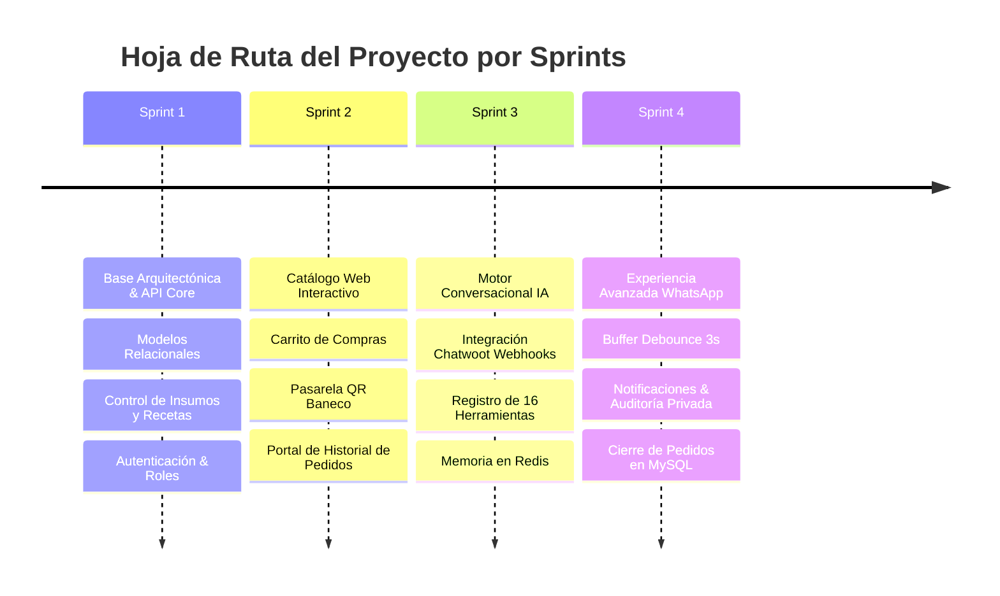
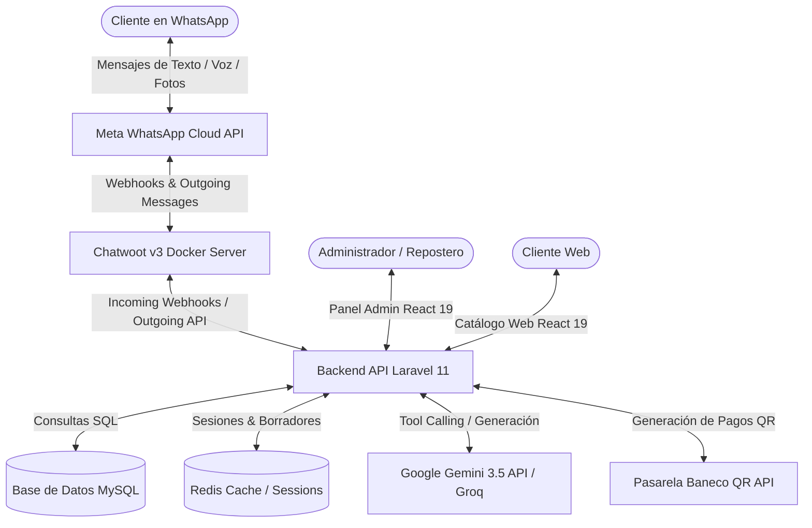
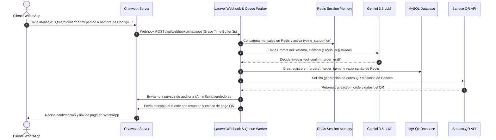

# 🍰 Dulce Encanto — Plataforma Integral de Gestión, Catálogo Interactivo y Asistente IA Conversacional


¡Bienvenido a la documentación técnica principal del proyecto **Dulce Encanto**! Esta plataforma es una solución tecnológica integral de nivel empresarial diseñada para la gestión operativa, control de inventario basado en recetas, catálogo web de productos y ventas automatizadas para una repostería artesanal premium, integrando un **asistente conversacional inteligente autónomo en WhatsApp** mediante **Chatwoot**, **Tool Calling con LLM (Google Gemini / Groq)** y la pasarela oficial de **pagos QR del Banco Económico (Baneco)**.

---

## 🚀 Arquitectura General del Monorepo

El sistema está construido sobre una arquitectura desacoplada y modular organizada en tres subproyectos principales:

1. **`backend/` (API REST & Motor Conversacional IA):** Desarrollado con **Laravel 11** y PHP 8.2+, gestiona la lógica del negocio, inventario de insumos/recetas, autenticación mediante Laravel Sanctum, control de roles (Spatie), procesamiento de webhooks omnicanal de Chatwoot y la orquestación del bot cognitivo mediante Tool Calling con persistencia en **Redis** y **MySQL**.
2. **`frontend/` (Cliente Web & Panel Administrativo):** Single Page Application (SPA) responsiva y moderna construida con **React 19**, **TypeScript**, **Vite** y **Tailwind CSS v4**. Incluye tanto el catálogo interactivo público con carrito de compras y seguimiento de pedidos, como el panel administrativo para reposteros y vendedores.
3. **`chatwoot/` (Pasarela Omnicanal & Docker Container):** Infraestructura autocontenida basada en **Docker Compose** que aloja una instancia de **Chatwoot v3** conectada a PostgreSQL (con `pgvector`), Redis y Sidekiq para recibir los mensajes de WhatsApp Cloud API y delegar el procesamiento a Laravel.

---

## 📑 Resumen de Sprints del Proyecto

El desarrollo del proyecto fue estructurado en 4 fases metodológicas clave:



### 🔹 Sprint 1: Base Arquitectónica, Modelado Relacional y Gestión de Insumos
* **Diseño de Base de Datos MySQL:** Modelado relacional completo para usuarios, categorías, productos, variantes (`READY_STOCK` vs `MADE_TO_ORDER`), adicionales/extras, insumos/suministros, recetas y órdenes.
* **Autenticación & Autorización:** Integración de Laravel Sanctum y Spatie Permission con 3 roles principales: `Administrador`, `Repostero` y `Vendedor`.
* **Módulo de Insumos y Recetas:** Lógica automatizada de conversión de unidades de medida (gramos, kilos, mililitros, unidades) y descuento de stock de insumos por producción.

### 🔹 Sprint 2: Catálogo Web Interactivo, Carrito y Pasarela QR Baneco
* **Cliente Web React 19:** Catálogo interactivo público con visualización de categorías, variantes, adicionales compatibles y carrito de compras (`CartContext`).
* **Pasarela de Pagos QR (Banco Económico - Baneco):** Integración con la API oficial de Baneco cifrada en **AES-256-CBC**, permitiendo la generación de códigos QR de cobro dinámico con expiración y webhooks de confirmación automática de pago.
* **Portal de Seguimiento de Pedidos:** Vista pública de consulta de historial y estado de producción en tiempo real mediante tokens seguros sin requerir autenticación.

### 🔹 Sprint 3: Motor Conversacional IA y Tool Calling
* **Orquestador Conversacional (`ConversationOrchestrator`):** Flujo de control de mensajes que conecta Chatwoot con proveedores de LLM (**Google Gemini 3.5 Flash Lite** y **Groq Llama 3.3 70B**).
* **Registro de 16 Herramientas de IA (`ToolRegistry`):** Implementación del patrón *Tool Calling* para permitir que la IA consulte productos, variantes, promociones, adicionales y administre el carrito temporal en Redis.
* **Gestión de Borradores en Redis:** Implementación de `OrderDraftManager` para mantener carritos temporales por cliente (`wa_session:wa_order_draft:{$phone}`) sin saturar MySQL.
* **Manejo de Contexto y Ventana de Tokens:** Control de ventana de atención de mensajes y podado seguro para evitar sobrecostos o fallos de payload en la API de Gemini/Groq.

### 🔹 Sprint 4: Experiencia Avanzada de Chatbot y Cierre de Pedidos en MySQL
* **Grace Time Buffer (Debounce de 3 segundos en Redis):** Sistema de amortiguación que concatena múltiples mensajes rápidos enviados por el cliente en WhatsApp en un único prompt para la IA, reduciendo un 70% el consumo de tokens y evitando respuestas duplicadas.
* **Indicador de "Escribiendo..." (`typing_status`):** Notificación visual en tiempo real en la interfaz de WhatsApp mientras el modelo de IA procesa la respuesta.
* **Auditoría Interna con Notas Privadas en Chatwoot:** Registro automático de notas privadas amarillas en la bandeja de Chatwoot cada vez que la IA realiza acciones en el carrito (agregar producto, modificar cantidad, confirmar borrador).
* **Resumen Automático por Inactividad (30 min):** Generación de resumen conversacional e inserción como nota privada cuando transcurren 30 minutos sin interacción.
* **Cierre y Registro de Pedidos en MySQL (`ConfirmOrderDraftTool`):** Consolidación definitiva del borrador de Redis en la base de datos MySQL, vaciado del carrito y devolución inmediata del enlace seguro para el pago mediante código QR.
* **Procesamiento de Notas de Voz e Imágenes:** Detección y extracción de adjuntos en mensajes de WhatsApp.
* **Regla 10 (Ocultamiento Estricto de IDs):** Instrucción del sistema que prohíbe explícitamente a la IA mostrar identificadores numéricos de la BD (`[ID: 1]`) al cliente final.

---

## 🛠️ Tecnologías Utilizadas

| Capa / Módulo | Tecnología / Librería | Descripción |
| :--- | :--- | :--- |
| **Backend Framework** | Laravel 11.x (PHP 8.2+) | API RESTful, Jobs en cola, Eventos y Webhooks. |
| **Autenticación** | Laravel Sanctum & Spatie RBAC | Control de acceso basado en roles y tokens. |
| **Motor de IA Conversacional** | Google Gemini API (`gemini-3.5-flash-lite`) / Groq (`llama-3.3-70b`) | Inferencia de LLM basada en Tool Calling / Function Calling. |
| **Persistencia & Caching** | MySQL 8.0 & Redis 7.0 | Persistencia de datos operacionales y sesiones conversacionales. |
| **Pasarela de Pago** | API Banco Económico (Baneco) | Generación y verificación de cobros QR cifrados con AES-256. |
| **Frontend Framework** | React 19 + TypeScript + Vite | Single Page Application (SPA) con arquitectura por módulos. |
| **Estilos & UI** | Tailwind CSS v4 + Lucide Icons | Diseño responsive premium, animaciones fluidas y modo oscuro. |
| **Omnicanalidad & Bot Gateway** | Chatwoot v3 (Docker Compose) | Gestión de mensajería omnicanal de WhatsApp Cloud API. |
| **Infraestructura & Túneles** | Cloudflare Tunnels (`cloudflared`) | Túneles seguros para exposición local de webhooks y API. |

---

## 📐 Arquitectura del Sistema y Flujo Técnico



### Flujo de Confirmación de Pedido y Código QR



---

## 📂 Mapa de Estructura de Directorios

```text
dulce-encanto/
├── backend/                              # Aplicación Backend Laravel 11 (API & Engine IA)
│   ├── app/
│   │   ├── AI/                           # Núcleo de Inteligencia Artificial Conversacional
│   │   │   ├── Contracts/                # Interfaces (ToolInterface, AIProviderInterface, etc.)
│   │   │   ├── Memory/                   # Gestión de memoria de sesiones en Redis
│   │   │   ├── Orders/                   # Borrador de pedidos en Redis (OrderDraft, OrderItemDraft)
│   │   │   ├── Orchestrators/            # ConversationOrchestrator (Flujo principal del Bot)
│   │   │   ├── Prompts/                  # System Prompts y Reglas del Negocio (DulceEncantoPrompt)
│   │   │   ├── Providers/                # GeminiProvider y GroqProvider
│   │   │   ├── Registry/                 # ToolRegistry (Registro de las 16 herramientas)
│   │   │   ├── Services/                 # AIConversationService (Estimación y podado de tokens)
│   │   │   └── Tools/                    # Implementación de las 16 Herramientas (Catalog, Orders, Business)
│   │   ├── Baneco/                       # Integración Cifrada AES-256 con Banco Económico (QR)
│   │   ├── DTO/                          # Data Transfer Objects (ChatwootMessageDTO, StoreOrderDTO, etc.)
│   │   ├── Http/Controllers/Api/V1/      # Controladores API (Catalog, Order, Production, Webhook, etc.)
│   │   ├── Jobs/                         # ProcessIncomingMessageJob (Debounce & Queue Processing)
│   │   ├── Models/                       # Modelos Eloquent (Product, Variant, Order, Supply, Recipe, etc.)
│   │   ├── Observers/                    # OrderObserver (Disparador automático de cobros QR)
│   │   ├── Repositories/                 # Repositorios de acceso a datos
│   │   └── Services/                     # Servicios de Dominio (ChatwootService, OrderService, etc.)
│   ├── config/                           # Archivos de Configuración (ai.php, chatwoot.php, baneco.php)
│   ├── database/                         # Migraciones relacionales, Seeders y Vistas SQL
│   └── routes/                           # Definición de Rutas API (api.php)
│
├── frontend/                             # Aplicación Frontend React 19 (SPA)
│   ├── public/                           # Assets estáticos del cliente
│   └── src/
│       ├── app/                          # Proveedores de Contexto (CartContext, AuthContext) y Rutas
│       ├── components/                   # Componentes UI reutilizables (Navbar, Layout, UI Elements)
│       ├── lib/                          # Cliente HTTP Axios e interceptores CSRF/Sanctum
│       ├── modules/                      # Módulos del Sistema por Dominio:
│       │   ├── auth/                     # Iniciar Sesión y Autenticación
│       │   ├── catalog/                  # Catálogo Web Público, Carrito y Pago QR
│       │   ├── orders/                   # Gestión Administrativa de Pedidos
│       │   ├── production/               # Gestión de Lotes de Producción y Recetas
│       │   ├── products/                 # CRUD de Productos, Variantes y Precios
│       │   ├── recipes/                  # Formulaciones de Recetas e Insumos
│       │   ├── suppliers/                # CRUD de Proveedores de Insumos
│       │   ├── supplies/                 # Control de Stock de Insumos / Materia Prima
│       │   └── users/                    # Administración de Usuarios y Roles
│       └── shared/                       # Servicios de API, Hooks y Tipos TypeScript
│
├── chatwoot/                             # Infraestructura Docker Compose para Chatwoot
│   ├── docker-compose.yml                # Configuración de contenedores (Chatwoot, Postgres, Redis, Sidekiq)
│   └── .env.example                      # Variables de entorno de la instancia local de Chatwoot
│
├── SPRINT_1.md                           # Documentación detallada del Sprint 1
├── SPRINT_2.md                           # Documentación detallada del Sprint 2
├── SPRINT_3.md                           # Documentación detallada del Sprint 3
├── SPRINT_4.md                           # Documentación detallada del Sprint 4
├── DATABASE_MODEL.md                     # Modelo y Diccionario de Datos SQL
└── README.md                             # Documentación Técnica Principal del Repositorio
```

---

## 🤖 Tabla de Herramientas de IA Registradas (16 Tools)

El motor conversacional dispone de **16 herramientas de negocio** invocables autónomamente por el modelo de IA:

| Herramienta | Propósito de Negocio | Parámetros Principales |
| :--- | :--- | :--- |
| `get_business_info` | Obtener datos generales, dirección y contacto de Dulce Encanto. | Ninguno. |
| `get_opening_hours` | Obtener el horario público de atención en tienda. | Ninguno. |
| `search_categories` | Buscar categorías de productos activas en el catálogo. | `query` (string, opcional). |
| `search_products` | Buscar productos por nombre o ingredientes. | `query` (string, opcional). |
| `search_variants` | Buscar presentaciones/variantes con precios, stock y porciones. | `product_id` (int), `query` (string). |
| `get_variant_extras` | Consultar adicionales compatibles con una variante elegida. | `variant_id` (int, requerido). |
| `search_extras` | Buscar adicionales/toppings generales del catálogo. | `query` (string, opcional). |
| `search_promotions` | Consultar ofertas y descuentos vigentes. | `query` (string, opcional). |
| `add_to_order_draft` | Añadir una variante y cantidad al carrito borrador de Redis. | `variant_id` (int), `quantity` (int). |
| `update_order_item_quantity` | Modificar la cantidad de un producto en el borrador. | `variant_id` (int), `quantity` (int). |
| `remove_from_order_draft` | Eliminar un producto del borrador temporal. | `variant_id` (int, requerido). |
| `add_extra_to_order_item` | Añadir un topping a un producto del borrador. | `variant_id` (int), `extra_id` (int). |
| `remove_extra_from_order_item` | Quitar un topping de un producto del borrador. | `variant_id` (int), `extra_id` (int). |
| `get_order_draft_summary` | Obtener el resumen con subtotales e impuestos del borrador. | Ninguno. |
| `confirm_order_draft` | **Consolidar la compra en MySQL, generar orden y link QR de pago.** | `customer_name`, `delivery_type`, `delivery_date`, `delivery_time`. |
| `get_order_history_link` | Generar el link seguro de consulta de historial de pedidos. | Ninguno. |

---

## 💻 Guía de Instalación y Ejecución Local

Sigue este paso a paso para clonar y ejecutar todo el ecosistema en tu entorno local.

### 📋 Requisitos Previos
* **Docker Desktop** (instalado y activo).
* **Node.js v20+** y **npm v10+**.
* **PHP v8.2+** con extensiones `pdo_mysql`, `redis`, `mbstring`, `openssl`, `curl`.
* **Composer v2.5+**.
* **Cloudflare CLI (`cloudflared`)** para exposición local de webhooks.

---

### Paso 1: Levantar Chatwoot con Docker Compose (Puerto 3001)

1. Ve al directorio `chatwoot/`:
   ```bash
   cd chatwoot
   ```
2. Crea el archivo `.env` a partir del ejemplo:
   ```bash
   cp .env.example .env
   ```
3. Inicia los contenedores en segundo plano:
   ```bash
   docker compose up -d
   ```
4. Ingresa a `http://localhost:3001` en tu navegador, crea la cuenta de superadministrador e inicia sesión.
5. Crea un nuevo **Inbox de WhatsApp** en la plataforma de Chatwoot.

---

### Paso 2: Exponer Servicios Locales con Cloudflare Tunnels

Abre dos terminales adicionales para exponer tus puertos locales mediante túneles rápidos de Cloudflare:

* **Túnel para el Backend Laravel (Puerto 8000):**
  ```bash
  cloudflared tunnel --url http://localhost:8000
  ```
  *(Copia la URL HTTPS generada, ejemplo: `https://walk-notebook-matthew-stuart.trycloudflare.com`)*

* **Túnel para Chatwoot (Puerto 3001):**
  ```bash
  cloudflared tunnel --url http://localhost:3001
  ```
  *(Copia la URL HTTPS generada, ejemplo: `https://reservoir-earthquake-day-music.trycloudflare.com`)*

---

### Paso 3: Configurar el Webhook en la Interfaz de Chatwoot

1. Dentro de la plataforma de Chatwoot (`http://localhost:3001`), dirígete a **Ajustes > Integraciones > Webhooks**.
2. Haz clic en **Añadir nuevo Webhook**.
3. Pega la URLHTTPS de tu túnel de Laravel agregando el endpoint `/api/webhooks/chatwoot`:
   ```text
   https://<tu-tunel-backend>.trycloudflare.com/api/webhooks/chatwoot
   ```
4. Selecciona los eventos de mensajes entrantes (`message_created`) y guarda la integración.

---

### Paso 4: Configurar y Levantar el Backend Laravel 11

1. Dirígete a la carpeta `backend/`:
   ```bash
   cd backend
   ```
2. Instala las dependencias de PHP:
   ```bash
   composer install
   ```
3. Crea tu archivo de variables de entorno `.env`:
   ```bash
   cp .env.example .env
   ```
4. Configura en el `.env` tus credenciales de base de datos MySQL, tus API Keys de **Gemini** / **Groq** y la URL de Chatwoot obtenida en el Paso 2:
   ```env
   CHATWOOT_URL=https://<tu-tunel-chatwoot>.trycloudflare.com
   CHATWOOT_API_TOKEN=tu_token_de_chatwoot
   CHATWOOT_ACCOUNT_ID=1
   CHATWOOT_INBOX_ID=1
   AI_PROVIDER=gemini
   OPENAI_API_KEY=tu_api_key_de_gemini
   ```
5. Genera la llave de la aplicación y ejecuta las migraciones con datos iniciales (seeders):
   ```bash
   php artisan key:generate
   php artisan migrate:fresh --seed
   ```
6. Inicia el servidor de desarrollo de Laravel:
   ```bash
   php artisan serve
   ```
7. **CRÍTICO:** En una terminal separada, inicia el procesador de colas en segundo plano para procesar los webhooks y la IA:
   ```bash
   php artisan queue:work
   ```

---

### Paso 5: Configurar y Levantar el Frontend React 19 (Puerto 5173)

1. Dirígete a la carpeta `frontend/`:
   ```bash
   cd frontend
   ```
2. Instala las dependencias de Node.js:
   ```bash
   npm install
   ```
3. Crea tu archivo `.env`:
   ```bash
   cp .env.example .env
   ```
4. Asegúrate de que `VITE_API_URL` apunte a tu servidor local de Laravel (`http://localhost:8000`).
5. Inicia el servidor de desarrollo Vite:
   ```bash
   npm run dev
   ```
6. Abre `http://localhost:5173` en tu navegador para explorar el **Catálogo Web Interactivo** o el **Panel de Administración**.

---

## 🔒 Licencia y Créditos

Desarrollado como una plataforma integral de repostería artesanal por el equipo de **Dulce Encanto**. Todos los derechos reservados © 2026.
