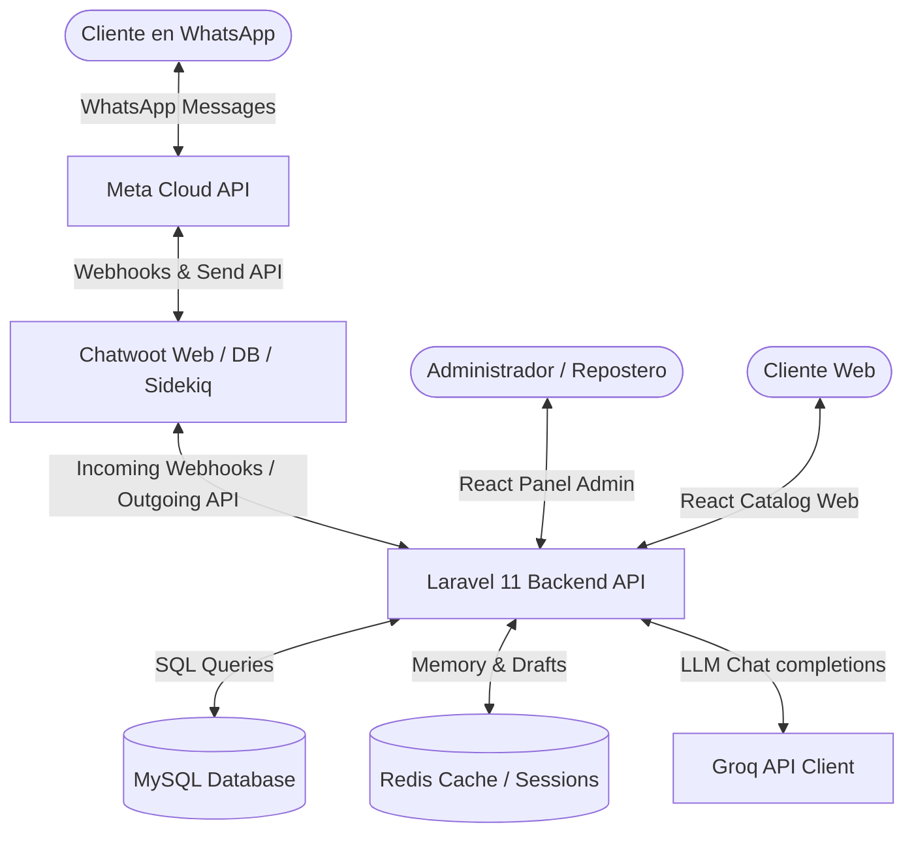
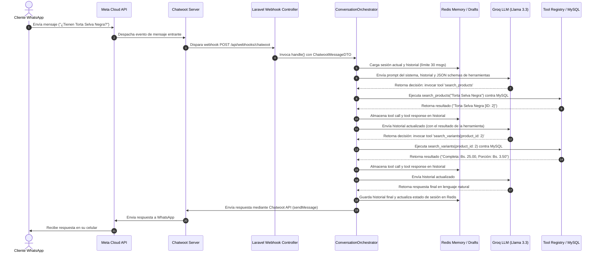

# Dulce Encanto — Plataforma Integral de Gestión, Catálogo y Asistente IA

¡Bienvenido a la documentación técnica principal del repositorio de **Dulce Encanto**! Este proyecto es una solución digital de nivel empresarial diseñada para una pastelería artesanal premium, integrando un panel administrativo robusto, un catálogo público interactivo, y un asistente conversacional automatizado inteligente vía WhatsApp.

El sistema se compone de una arquitectura monorepo desacoplada con tres subproyectos clave:
1. **Backend:** API REST robusta y segura desarrollada con **Laravel 11**, base de datos relacional MySQL y persistencia transitoria en **Redis**.
2. **Frontend:** Single Page Application (SPA) responsiva y moderna construida con **React 19**, **TypeScript**, **Vite** y **Tailwind CSS v4**.
3. **Chatwoot & Docker:** Infraestructura autocontenida que aloja una instancia local de **Chatwoot v3** con base de datos PostgreSQL/pgvector, Redis y Sidekiq para el enrutamiento de mensajería omnicanal.

---

## 🎯 Objetivo del Sistema

Automatizar la gestión operativa, control de inventario de insumos (basado en recetas) y ventas de la repostería, al mismo tiempo que se ofrece a los clientes canales modernos de consulta y compra (Catálogo Web interactivo y Asistente Conversacional IA en WhatsApp) garantizando consistencia de stock en tiempo real y erradicando alucinaciones de precios/productos mediante grounding estricto contra base de datos.

---

## 🛠️ Tecnologías Utilizadas

* **Core Backend:** PHP 8.2+, Laravel 11.x, Laravel Sanctum, Spatie Permission.
* **Conversational AI Engine:** Groq API SDK (Model: `llama-3.3-70b-versatile`), Redis 7.x, Redis-backed PHP session manager.
* **Base de Datos:** MySQL / Sqlite (para testing), PostgreSQL 15 (con extensión `pgvector` para Chatwoot).
* **Frontend Client:** React 19, TypeScript, Vite, Tailwind CSS v4, TanStack Query v5, React Router v7, Sonner (Toasts), React Icons.
* **Infraestructura:** Docker Compose, Cloudflare Tunnels (Quick Tunnels / Named Tunnels), Meta WhatsApp Cloud API.

---

## 📐 Arquitectura General del Sistema

El sistema implementa una arquitectura basada en microservicios simplificada, unificada mediante webhooks y túneles seguros:



### Propósito de cada componente:
* **Meta Cloud API:** Puerta de enlace oficial de WhatsApp que recibe los mensajes del cliente y los envía a Chatwoot.
* **Chatwoot:** Plataforma de atención omnicanal que centraliza las conversaciones. Actúa como bandeja de entrada de los agentes humanos y delega los mensajes del bot a Laravel a través de webhooks configurados.
* **Laravel Backend API:** Núcleo lógico del negocio. Expone la API REST de administración y gestiona el webhook que recibe eventos de Chatwoot.
* **ConversationOrchestrator:** Coordinador conversacional dentro de Laravel que maneja el flujo del bot, su memoria temporal y el ciclo de ejecución de herramientas.
* **Groq API Client:** Proveedor de inferencia de LLM de ultrabaja latencia que procesa los mensajes del cliente y genera llamadas a herramientas o texto final.
* **MySQL/Redis:** Persistencia de datos operacionales (catálogo, recetas, órdenes, usuarios) en MySQL y almacenamiento transitorio veloz de sesiones conversacionales e item drafts en Redis.

---

## 🤖 Arquitectura del Chatbot y Flujo Técnico

El asistente conversacional utiliza un flujo de agentes cognitivos basado en **Tool Calling (llamadas a funciones)** con memoria de corto plazo integrada sobre Redis:



---

## 🔍 Auditoría Técnica del Chatbot

### 1. ¿Qué puede hacer el Chatbot actualmente?
El chatbot es un agente conversacional capaz de:
* **Responder preguntas del negocio:** Información general, horarios de atención, métodos de contacto y ubicación física.
* **Consultar el catálogo:** Buscar categorías, buscar productos específicos y consultar promociones y ofertas vigentes.
* **Detalle de productos y precios:** Consultar las variantes de un producto para saber los tamaños, porciones y precios exactos en Bolivianos (Bs.).
* **Gestión de pedidos (Borrador):** Armar dinámicamente un carrito/borrador de pedidos temporal. Puede añadir productos, modificar cantidades, eliminar artículos, añadir adicionales/extras (toppings, velas, etc.), consultar el resumen del pedido con subtotales/totales calculados, y vaciar el borrador.

### 2. Herramientas de IA Registradas (Tools)
El sistema dispone de **14 herramientas** de negocio registradas en [ToolRegistry.php](file:///c:/Users/VICTUS/.gemini/antigravity-ide/scratch/dulce-encanto/backend/app/AI/Registry/ToolRegistry.php):

| Nombre de Herramienta | Propósito Operativo | Parámetros |
| :--- | :--- | :--- |
| `get_business_info` | Obtener descripción, dirección y contacto de la repostería. | Ninguno. |
| `get_opening_hours` | Obtener los horarios de atención al cliente. | Ninguno. |
| `search_categories` | Buscar categorías de productos activas en el catálogo. | `query` (string, opcional). |
| `search_products` | Buscar productos por nombre o descripción. | `query` (string, opcional). |
| `search_variants` | Buscar presentaciones/variantes de productos (precios, stock, porciones). | `product_id` (int, opcional), `query` (string, opcional). |
| `search_extras` | Buscar adicionales que se pueden agregar a las variantes. | `query` (string, opcional). |
| `search_promotions` | Buscar ofertas y promociones vigentes. | `query` (string, opcional). |
| `add_to_order_draft` | Añadir un variant_id con una cantidad al borrador del pedido. | `variant_id` (int, requerido), `quantity` (int, opcional). |
| `update_order_item_quantity` | Modificar la cantidad de un artículo en el borrador. | `variant_id` (int, requerido), `quantity` (int, requerido). |
| `remove_from_order_draft` | Quitar un artículo del borrador del pedido. | `variant_id` (int, requerido). |
| `add_extra_to_order_item` | Añadir un topping/extra a un artículo del borrador del pedido. | `variant_id` (int, requerido), `extra_id` (int, requerido). |
| `remove_extra_from_order_item`| Quitar un topping/extra de un artículo del borrador del pedido. | `variant_id` (int, requerido), `extra_id` (int, requerido). |
| `get_order_draft_summary` | Obtener un desglose estructurado con subtotales e impuestos del borrador. | Ninguno. |
| `clear_order_draft` | Vaciar completamente el borrador del pedido del cliente. | Ninguno. |

### 3. Memoria Conversacional y Estado en Redis
* **Ubicación de Memoria:** Gestionada por [RedisConversationMemory.php](file:///c:/Users/VICTUS/.gemini/antigravity-ide/scratch/dulce-encanto/backend/app/AI/Memory/RedisConversationMemory.php) utilizando la interfaz de repositorio de sesiones de Redis.
* **Límite de Historial:** La conversación está acotada estrictamente a los últimos **30 mensajes** (roles: `user`, `assistant`, `tool`) para evitar saturación de la ventana de contexto del LLM.
* **Claves de almacenamiento en Redis (bajo el prefijo de Laravel):**
  * Conversación e historial: `wa_session:$phone`
  * Borrador de pedido temporal: `wa_session:wa_order_draft:$phone`

### 4. Estructuración del Borrador de Pedidos (Order Draft)
El borrador se compone de:
* Un modelo principal [OrderDraft.php](file:///c:/Users/VICTUS/.gemini/antigravity-ide/scratch/dulce-encanto/backend/app/AI/Orders/OrderDraft.php) que mantiene el teléfono del cliente, lista de items, subtotal, descuento, y total.
* Artículos de línea representados por [OrderItemDraft.php](file:///c:/Users/VICTUS/.gemini/antigravity-ide/scratch/dulce-encanto/backend/app/AI/Orders/OrderItemDraft.php) con `variantId`, `quantity`, `unitPrice` y una lista de extras asociados.
* Los cálculos de subtotales y totales se ejecutan a nivel de objeto antes de guardarse en Redis, asegurando que la IA siempre reciba precios exactos y consolidados.

### 5. Limitaciones y Errores Conocidos Actualmente
* **Ausencia de Checkout por WhatsApp:** El bot permite armar el pedido en borrador, pero **no tiene la capacidad de consolidarlo como una orden confirmada en MySQL** (es decir, crear registros en las tablas `orders` y `order_items`). Esta funcionalidad está pendiente de completarse en el Sprint 3.
* **Sin pasarela de pago simulada:** No existe flujo para procesar o simular un pago desde la conversación.
* **Dependencia de Túneles Ephemeros:** Si se utilizan túneles dinámicos de Cloudflare (`trycloudflare.com`), al reiniciar el servicio el hostname cambia. Esto exige reconfigurar manualmente las variables de entorno de Chatwoot/Laravel y el webhook dentro de la interfaz administrativa de Chatwoot.
* **Bases de datos en test vacías:** En pruebas unitarias automatizadas (`php artisan test`), las bases de datos SQLite en memoria requieren el trait de migración y seeders manuales, de lo contrario las consultas de herramientas devuelven que las tablas de catálogo no existen.

---

## 📂 Estructura del Proyecto

```text
dulce-encanto/
├── backend/                  # Aplicación Laravel 11 (API Backend & Chatbot Engine)
│   ├── app/
│   │   ├── AI/               # Módulos del Motor Conversacional y Asistente IA
│   │   │   ├── Contracts/    # Interfaces de Proveedores de IA, Memoria y Herramientas
│   │   │   ├── DTO/          # DTOs de respuesta y control
│   │   │   ├── Memory/       # Implementación de memoria conversacional en Redis
│   │   │   ├── Orchestrators/# Coordinador de flujo conversacional y bucle de tools
│   │   │   ├── Orders/       # Gestión de borradores de pedidos en memoria
│   │   │   ├── Prompts/      # Prompts del sistema y reglas de Grounding de Dulce Encanto
│   │   │   ├── Providers/    # Proveedores de LLM (Groq API HTTP Wrapper)
│   │   │   └── Registry/     # Registro y mapeo de herramientas para el LLM
│   │   │   └── Tools/        # Clases independientes para las 14 herramientas del bot
│   │   ├── Http/
│   │   │   ├── Controllers/  # Controladores REST API y Webhooks
│   │   │   ├── Requests/     # Validaciones de formularios y webhooks
│   │   │   └── Resources/    # Transformadores de datos JSON para la API
│   │   ├── Models/           # Modelos de Eloquent y DTOs de sesión
│   │   ├── Repositories/     # Patrón Repository para base de datos e IA
│   │   └── Services/         # Lógica de negocio (Autenticación, Pedidos, Inventarios)
│   ├── config/               # Archivos de configuración (ai.php, chatwoot.php, etc.)
│   ├── database/             # Migraciones, seeders y factorías
│   ├── routes/               # Rutas de la API REST (api.php) y Consola
│   └── tests/                # Pruebas unitarias y de integración
│
├── frontend/                 # Aplicación React 19 Client SPA
│   ├── src/
│   │   ├── app/              # Proveedores globales de contexto y layouts principales
│   │   ├── design-system/    # Biblioteca de componentes UI reutilizables y atómicos
│   │   ├── modules/          # Módulos encapsulados por dominio funcional (auth, catalog, products...)
│   │   └── shared/           # Utilidades compartidas, tipos globales y servicios de red
│   └── package.json
│
├── chatwoot/                 # Infraestructura Dockerizada de Chatwoot local
│   ├── docker-compose.yml    # Composición de contenedores (Postgres pg15, Redis 7, Web, Sidekiq)
│   ├── .env.example          # Variables de entorno base para levantar Chatwoot
│   └── uploads/              # Carpeta montada para persistencia de archivos subidos
└── workflows.md              # Documentación de referencia legacy para flujos n8n
```

---

## ⚙️ Variables de Entorno Importantes

### Backend (`backend/.env`)
* `DB_DATABASE`, `DB_USERNAME`, `DB_PASSWORD`: Credenciales de acceso a MySQL.
* `REDIS_HOST`, `REDIS_PORT`, `REDIS_PASSWORD`: Conexión al servidor Redis local/compartido.
* `CHATWOOT_URL`: URL base de la instancia de Chatwoot (ej. la generada por el túnel de Cloudflare).
* `CHATWOOT_API_TOKEN`: Access Token del agente/administrador de Chatwoot para interactuar con la API.
* `CHATWOOT_ACCOUNT_ID`: ID numérico de la cuenta operativa de Chatwoot (generalmente `1` o `2`).
* `CHATWOOT_INBOX_ID`: ID numérico de la bandeja de entrada de WhatsApp configurada.
* `CHATWOOT_SEND_RESPONSES`: Booleano (`true`/`false`) para habilitar o desactivar el envío de respuestas de IA al cliente final.
* `AI_PROVIDER`: Establecido en `groq`.
* `GROQ_API_KEY`: API Key de autenticación de Groq Cloud Console.
* `GROQ_MODEL`: Modelo LLM utilizado (`llama-3.3-70b-versatile`).
* `GROQ_TEMPERATURE`: Temperatura de generación (`0.2` para control estricto de alucinaciones).
* `GROQ_TOP_P`: Ajuste de núcleo probabilístico (`0.9`).
* `BANECO_BASE_URL`: URL base de la API de Baneco (por defecto en certificación).
* `BANECO_USERNAME`: Nombre de usuario asignado por el banco.
* `BANECO_PASSWORD`: Contraseña asignada por el banco.
* `BANECO_AES_KEY`: Llave de encriptación AES-256 bits (32 bytes).
* `BANECO_ACCOUNT`: Número de cuenta corriente o caja de ahorro autorizada.
* `BANECO_TIMEOUT`: Tiempo límite de las peticiones HTTP (por defecto 30).
* `BANECO_QR_EXPIRATION_DAYS`: Días de vigencia por defecto para los códigos QR generados.

### Chatwoot (`chatwoot/.env`)
* `POSTGRES_USER`, `POSTGRES_PASSWORD`, `POSTGRES_DB`: Credenciales del motor PostgreSQL local.
* `SECRET_KEY_BASE`: Clave de cifrado de Rails.
* `FRONTEND_URL`: Dirección HTTP pública externa de Chatwoot (debe ser la misma URL del túnel Cloudflare).
* `SMTP_PASSWORD`: Token de envío de correos vía Resend (opcional).

### Frontend (`frontend/.env`)
* `VITE_API_URL`: Dirección HTTP del servidor del backend local de Laravel (ej. `http://localhost:8000`).

---

## 📦 Gestión de Infraestructura Local (Docker, Redis, Chatwoot, Tunnel)

### 1. Docker Compose
La instancia de Chatwoot local corre de manera independiente en contenedores definidos en [docker-compose.yml](file:///c:/Users/VICTUS/.gemini/antigravity-ide/scratch/dulce-encanto/chatwoot/docker-compose.yml):
* **chatwoot-db**: Postgres con soporte para `pgvector` para futuras búsquedas de similitud/embeddings.
* **chatwoot-redis**: Servidor Redis dedicado para la gestión de colas de Sidekiq y persistencia veloz de Chatwoot.
* **chatwoot-web**: Servidor web principal que corre la API y el portal web en Ruby on Rails (Puerto expuesto en host: `3001`).
* **chatwoot-sidekiq**: Procesador de trabajos en segundo plano (envío de webhooks, procesamiento de eventos).

### 2. Redis
El backend de Laravel utiliza el mismo u otro servidor Redis para almacenar la memoria conversacional y el estado de los pedidos del cliente. Esto se realiza de manera atómica para evitar colisiones entre conversaciones paralelas de diferentes números telefónicos.

### 3. Cloudflare Tunnel
El proyecto depende actualmente de túneles externos para exponer los servidores locales a internet de manera segura, permitiendo a Chatwoot recibir webhooks de Meta y a Laravel recibir webhooks de Chatwoot:
* **Túnel de Chatwoot (Puerto 3001):** Expone la interfaz web de Chatwoot para recibir mensajes entrantes de WhatsApp/Meta.
* **Túnel de Laravel (Puerto 8000):** Expone la API de Laravel para recibir eventos de Chatwoot (`/api/webhooks/chatwoot`).
* *Nota:* Al usar túneles rápidos temporales (`trycloudflare.com`), se generan URLs dinámicas que cambian al reiniciar el equipo.

---

## 🛣️ Estado de los Sprints

### 🟢 Sprint 1: Catálogo y Panel Administrativo — COMPLETADO
* **Lado del Servidor:** Estructura completa de catálogo y parametrizaciones (Categorías, Productos, Variantes, Extras y Promociones) implementada en base de datos. Rutas de REST API protegidas con Sanctum y Spatie Roles.
* **Lado del Cliente:** SPA completa en React con modo oscuro/claro para la visualización del menú público de postres. Panel administrativo dinámico para la gestión de catálogos y control de accesos de personal (Administradores, Reposteros y Operadores).
* **Seguridad:** Control estricto de accesos a nivel de frontend por permisos e inicio de sesión seguro en backend.

### 🟢 Sprint 2: Control de Inventario y Ventas — COMPLETADO
* **Control de Materias Primas:** Módulos de Proveedores, Insumos/Suministros y Recetario completamente funcionales en backend y frontend.
* **Manejo de Transacciones de Compra:** Capacidad para registrar el ingreso y aumento del stock de insumos por compras directas a proveedores registrados.
* **Deducción de Inventario Inteligente:** Al cambiar el estado de un pedido a "En preparación" (In preparation), el sistema deduce automáticamente las cantidades exactas de insumos consumidos según las recetas de las variantes del pedido. Si el stock es insuficiente, se bloquea la transición y se devuelve un error estructurado 422.
* **Módulo de Reportes Operativos:** Reportes detallados de Ventas, Insumos, Productos y Producción con descarga directa en formatos Excel y PDF desde el Panel de Administración.
* **Pendientes menores:**
  - Implementar un sistema de alertas visuales/correo cuando un insumo caiga por debajo de un umbral mínimo de stock de seguridad.

### 🟢 Sprint 3: Canal de WhatsApp y Asistente IA — COMPLETADO

#### Funcionalidades implementadas:
* **Orquestación Conversacional Integrada:** Controlador de webhooks en Laravel que procesa, valida y responde de forma asíncrona a los mensajes entrantes de los clientes en Chatwoot.
* **Grounding y Mitigación de Alucinaciones:** Prompt de sistema de Dulce Encanto con reglas restrictivas que bloquean la creación de descripciones, tamaños, ingredientes y precios inexistentes en la base de datos MySQL.
* **Registro de Herramientas Operacionales:** Bucle interactivo de 15 herramientas que permite a la IA consultar en tiempo real el catálogo, horarios de la pastelería, disponibilidad de productos, adicionales específicos por variante (`get_variant_extras`), y administrar el borrador del pedido de un cliente en Redis.
* **Transformación del Borrador en Pedido Real (Checkout por WhatsApp):** El asistente finaliza y registra de forma definitiva el pedido en MySQL (`orders` y `order_items`), validando 24 horas de anticipación en tortas y limpiando la memoria en Redis tras completarse.
* **Formateador de Respuestas Estricto:** Mecanismo en el prompt del sistema que fuerza el cierre de etiquetas y la estructuración del JSON de herramientas en la API de Groq, solucionando los fallos de parseo tradicionales de Llama-3.3.
* **Memoria conversacional acotada:** Persistencia segura de sesiones y desgloses de pedidos en Redis con límites de tamaño para evitar fallos de desbordamiento de contexto de tokens.
* **Notificaciones Automáticas por WhatsApp:** Integración con eventos Eloquent y Observers en Laravel para enviar notificaciones de estado por WhatsApp (ej: *"Tu pedido #XX ya está listo"*).

### 🟢 Sprint 4: Proceso de Ventas y Pagos (Baneco) — COMPLETADO

#### Funcionalidades implementadas:
* **Checkout Web:** Generación de pedidos permanentes en MySQL desde la interfaz web del catálogo.
* **Integración Baneco API Market (v1.3.0):** Módulo aislado en `backend/app/Baneco/` para la comunicación con los servicios del Banco Económico S.A.
* **Cifrado AES-256 bits:** Cifrado simétrico de credenciales y números de cuentas corrientes/ahorros en el cliente HTTP.
* **Autenticación Bearer Token con Cache:** Gestión automatizada del ciclo de vida del Bearer Token de Baneco con caché para optimizar las peticiones de red.
* **Generación de QR y Webhook de Pago:** Petición asíncrona de generación de códigos QR para cobros a través de Pago Simple y recepción de confirmación vía Webhook con control de idempotencia por caché de Redis.
* **Comandos de Verificación:** Artisan commands `baneco:test` y `baneco:health` para diagnóstico rápido.

---

## 🛠️ Inicio Rápido del Entorno de Desarrollo

Cuando enciendas tu computadora y necesites arrancar el entorno completo de Dulce Encanto para desarrollo, sigue estos **10 pasos detallados**:

### Paso 1: Levantar Docker
Abre una terminal en la carpeta `/chatwoot` y levanta los servicios de la base de datos y mensajería en segundo plano:
```bash
cd chatwoot
docker compose up -d
```

### Paso 2: Verificar los Contenedores
Asegúrate de que los 4 contenedores de Chatwoot estén corriendo correctamente:
```bash
docker compose ps
```
*Deberías ver listados y en estado `Up` los contenedores: `chatwoot-db`, `chatwoot-redis`, `chatwoot-web` y `chatwoot-sidekiq`.*

### Paso 3: Levantar el Backend en Laravel
Abre una nueva terminal en la carpeta `/backend` y levanta el servidor local de desarrollo:
```bash
cd backend
php artisan serve
```
*El servidor estará sirviendo la API REST en `http://127.0.0.1:8000`.*

### Paso 4: Verificar la Conexión a Redis
Asegúrate de que tu Laravel puede comunicarse con Redis (usado para las sesiones de WhatsApp y los borradores de pedidos). Puedes probar la conectividad abriendo una consola interactiva:
```bash
php artisan tinker
> Illuminate\Support\Facades\Redis::ping();
// Debería retornar: true o "+PONG"
```

### Paso 5: Verificar que Chatwoot esté disponible
Abre tu navegador e ingresa a `http://localhost:3001`. Deberías poder ver la pantalla de inicio de sesión de tu instancia local de Chatwoot.

### Paso 6: Levantar el Servicio Cloudflared (Túneles)
Para que Chatwoot (y WhatsApp) puedan enviar eventos a tu backend local, necesitas levantar los túneles HTTP públicos.
1. Abre una terminal y expón tu backend Laravel (puerto 8000):
   ```bash
   cloudflared tunnel --url http://localhost:8000
   ```
   *Copia la URL pública generada (ej. `https://laravel-api-xyz.trycloudflare.com`).*
2. Abre otra terminal y expón tu portal de Chatwoot (puerto 3001):
   ```bash
   cloudflared tunnel --url http://localhost:3001
   ```
   *Copia la URL pública generada (ej. `https://chatwoot-web-abc.trycloudflare.com`).*

### Paso 7: Verificar que el Túnel esté Healthy e Integrado
1. Abre `/backend/.env` y actualiza la variable `CHATWOOT_URL` con la URL pública generada para tu Chatwoot en el paso anterior.
2. Abre `/chatwoot/.env` y actualiza `FRONTEND_URL` con la misma URL de Chatwoot.
3. Si cambiaste la URL de Chatwoot, reinicia sus contenedores en la terminal de `/chatwoot`:
   ```bash
   docker compose down && docker compose up -d
   ```

### Paso 8: Verificar que Laravel esté recibiendo Webhooks de Chatwoot
1. Inicia sesión en Chatwoot (`http://localhost:3001`).
2. Ve a **Ajustes > Bandejas de entrada**, selecciona tu bandeja de WhatsApp y ve a **Ajustes de Integración / Webhooks**.
3. Asegúrate de que la URL de webhook registrada apunte a la dirección de tu túnel de Laravel seguido de `/api/webhooks/chatwoot` (ej. `https://laravel-api-xyz.trycloudflare.com/api/webhooks/chatwoot`).
4. Si la URL es antigua, actualízala para apuntar a la URL activa de tu túnel de Laravel.

### Paso 9: Iniciar el Frontend React
Abre otra terminal en la carpeta `/frontend` y levanta el servidor de desarrollo de Vite:
```bash
cd frontend
npm run dev
```
*Ingresa al Panel Admin desde `http://localhost:5173/login`.*

### Paso 10: Enviar un Mensaje de Prueba
Envía un mensaje de texto de prueba (ej: *"¿Tienen Torta Selva Negra?"*) desde WhatsApp al número configurado, o simula el envío enviando una petición HTTP local con la suite REST Client usando el archivo [test.http](file:///c:/Users/VICTUS/.gemini/antigravity-ide/scratch/dulce-encanto/backend/http/test.http) en tu editor:
* Haz clic en **Send Request** sobre la primera petición de `test.http`.
* Revisa en tiempo real `/backend/storage/logs/laravel.log` para verificar que la IA haya recibido el mensaje, llamado a las herramientas correspondientes contra la base de datos de manera consecutiva, y generado la respuesta de manera exitosa.

---

### 🚨 Diagnóstico de Errores Comunes (Troubleshooting)

* **Error: "Failed to communicate with Groq LLM API"**:
  * Verifica que la variable `GROQ_API_KEY` en `/backend/.env` sea válida y no haya expirado.
  * Comprueba tu conexión a internet, ya que la API de Groq requiere salida externa.
* **Error de Esquema "invalid JSON schema compilation failed: expected object, but got array"**:
  * Ocurre si alguna herramienta devuelve un formato de propiedades vacío. El sistema cuenta con correcciones globales en [ToolRegistry.php](file:///c:/Users/VICTUS/.gemini/antigravity-ide/scratch/dulce-encanto/backend/app/AI/Registry/ToolRegistry.php) para evitar esto, asegúrate de no haber modificado esa lógica.
* **Error de base de datos sqlite en tests "no such table: products"**:
  * Las pruebas unitarias locales usan bases de datos temporales en memoria. Asegúrate de que tus nuevas clases de tests utilicen el trait `Illuminate\Foundation\Testing\RefreshDatabase` y llamen a `$this->seed()` antes de ejecutar las pruebas de herramientas de IA.
* **Error: "Chatwoot API sendMessage failed (404 Resource not found)"**:
  * Significa que la conversación o el ID con el que estás interactuando en las pruebas no existe en la base de datos real de Chatwoot. Modifica el ID de la conversación en tu archivo de prueba o simulación para que coincida con una conversación existente en tu panel de Chatwoot.
* **Chatwoot no envía las respuestas al cliente**:
  * Asegúrate de que `CHATWOOT_SEND_RESPONSES` esté en `true` en `/backend/.env` y de que el webhook en Chatwoot esté correctamente configurado.

---

## ☁️ Integración con Cloudflare Tunnel

### Túneles actuales:
* Actualmente el entorno utiliza **Túneles Rápidos Temporales** (`trycloudflare.com`), que exigen comandos interactivos manuales de `cloudflared` y la reconfiguración manual de URLs de webhook y variables `.env` cada vez que se reinician.

### Migración a Named Tunnel Permanente (Producción):
Para pasar a un túnel persistente y permanente que no exija reconfigurar nada al apagar o reiniciar la computadora, se debe seguir la siguiente planificación:
1. **Crear el Túnel Permanente en Cloudflare CLI:**
   ```bash
   cloudflared tunnel create dulce-encanto-tunnel
   ```
   *Esto generará un archivo de credenciales JSON en tu máquina.*
2. **Configurar el archivo de mapeo (`config.yml`):**
   Crea un archivo de configuración en tu sistema para apuntar tus subdominios a los puertos correspondientes de tus servicios locales:
   ```yaml
   tunnel: <TUNNEL_ID>
   credentials-file: /path/to/credentials.json

   ingress:
     - hostname: chatwoot.mi-pasteleria.com
       service: http://localhost:3001
     - hostname: api.mi-pasteleria.com
       service: http://localhost:8000
     - hostname: panel.mi-pasteleria.com
       service: http://localhost:5173
     - service: http_status:404
   ```
3. **Configurar los registros DNS (CNAME):**
   Crea los registros CNAME correspondientes en tu panel de administración de Cloudflare apuntando a `<TUNNEL_ID>.cfargotunnel.com`.
4. **Instalar como Servicio del Sistema:**
   Registra el túnel como un servicio persistente en segundo plano para que arranque automáticamente con el sistema operativo:
   ```bash
   cloudflared service install
   ```
5. **Consolidación en Entornos:**
   Una vez configurado, podrás configurar de manera definitiva:
   * En `/backend/.env`: `CHATWOOT_URL=https://chatwoot.mi-pasteleria.com`
   * En `/chatwoot/.env`: `FRONTEND_URL=https://chatwoot.mi-pasteleria.com`
   * En `/frontend/.env`: `VITE_API_URL=https://api.mi-pasteleria.com`
   * Webhook permanente de Chatwoot apuntando a: `https://api.mi-pasteleria.com/api/webhooks/chatwoot`.

---

## 📝 CHANGELOG (Historial de Cambios Recientes)

A continuación se detallan las implementaciones y modificaciones realizadas desde los últimos hitos de desarrollo del sistema:

### Chatwoot & Webhooks
* **NEW:** Creado [ChatwootWebhookController.php](file:///c:/Users/VICTUS/.gemini/antigravity-ide/scratch/dulce-encanto/backend/app/Http/Controllers/Api/Webhooks/ChatwootWebhookController.php) para interceptar peticiones entrantes del servicio de mensajería.
* **NEW:** Implementado [ChatwootWebhookService.php](file:///c:/Users/VICTUS/.gemini/antigravity-ide/scratch/dulce-encanto/backend/app/Services/ChatwootWebhookService.php) para validar números de teléfono, ignorar respuestas de bucle salientes y controlar excepciones.
* **NEW:** Desarrollado [ChatwootMessageDTO.php](file:///c:/Users/VICTUS/.gemini/antigravity-ide/scratch/dulce-encanto/backend/app/DTO/ChatwootMessageDTO.php) con métodos factoría `fromWebhook` y robustez ante fallos de payload para extracción limpia de parámetros.

### IA & Conversation Engine
* **NEW:** Creado [ConversationOrchestrator.php](file:///c:/Users/VICTUS/.gemini/antigravity-ide/scratch/dulce-encanto/backend/app/AI/Orchestrators/ConversationOrchestrator.php) que administra la ejecución en bucle asíncrono de llamadas de herramientas por parte de la IA con protección para bucles infinitos.
* **NEW:** Implementado [RedisConversationMemory.php](file:///c:/Users/VICTUS/.gemini/antigravity-ide/scratch/dulce-encanto/backend/app/AI/Memory/RedisConversationMemory.php) estructurando el guardado del historial de los últimos 30 mensajes conversacionales.
* **NEW:** Creado [GroqProvider.php](file:///c:/Users/VICTUS/.gemini/antigravity-ide/scratch/dulce-encanto/backend/app/AI/Providers/GroqProvider.php) con soporte de cabeceras seguras de portador, parametrizaciones de temperatura/top_p ajustables desde variables de entorno y soporte nativo de `tools`.

### Tool Calling & Registry
* **NEW:** Implementado [ToolRegistry.php](file:///c:/Users/VICTUS/.gemini/antigravity-ide/scratch/dulce-encanto/backend/app/AI/Registry/ToolRegistry.php) que centraliza las herramientas disponibles y soluciona dinámicamente problemas de formato de esquemas JSON de Groq.
* **NEW:** Desarrolladas las clases independientes para las 14 herramientas operacionales del bot en `app/AI/Tools/` cubriendo los dominios de Catálogo, Pedidos, Ofertas e Información corporativa.
* **UPDATE:** Añadido formato XML instructivo explícito al System Prompt en [DulceEncantoPrompt.php](file:///c:/Users/VICTUS/.gemini/antigravity-ide/scratch/dulce-encanto/backend/app/AI/Prompts/DulceEncantoPrompt.php) para mitigar y corregir la omisión de caracteres de cierre en las llamadas a funciones de Llama-3.3 en Groq.

### Control de Inventarios & Pedidos
* **NEW:** Creado [OrderDraftManager.php](file:///c:/Users/VICTUS/.gemini/antigravity-ide/scratch/dulce-encanto/backend/app/AI/Orders/OrderDraftManager.php) para la manipulación y persistencia en Redis de borradores de pedidos temporales de clientes.
* **UPDATE:** Modificada la lógica de actualización de pedidos en [OrderService.php](file:///c:/Users/VICTUS/.gemini/antigravity-ide/scratch/dulce-encanto/backend/app/Services/OrderService.php) para deducir de manera transaccional e inteligente las cantidades de materias primas de la tabla de insumos basándose en el recetario de los productos comprados, bloqueando y notificando la falta de stock.
* **NEW:** Implementado módulo de reportes y descargas en formatos PDF y Excel en [ReportController.php](file:///c:/Users/VICTUS/.gemini/antigravity-ide/scratch/dulce-encanto/backend/app/Http/Controllers/Api/V1/ReportController.php).

### Infraestructura & Docker
* **NEW:** Configuración del ecosistema de Chatwoot v3 local en contenedor Docker Compose mapeando Postgres (pgvector) y Redis alpino en redes compartidas internas.
* **UPDATE:** Refinado el archivo `.env` del backend para incorporar parámetros de sintonización del motor conversacional (`GROQ_TEMPERATURE`, `GROQ_TOP_P`, `CHATWOOT_SEND_RESPONSES`).
