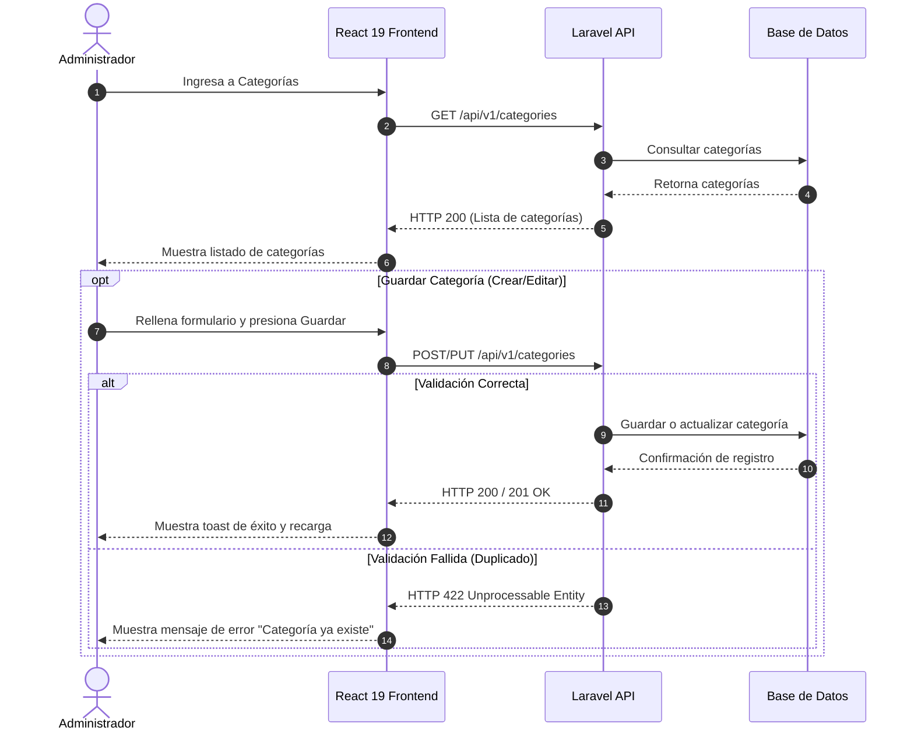
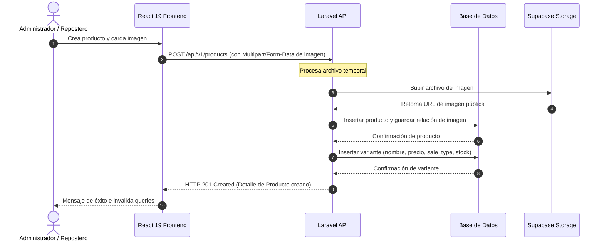
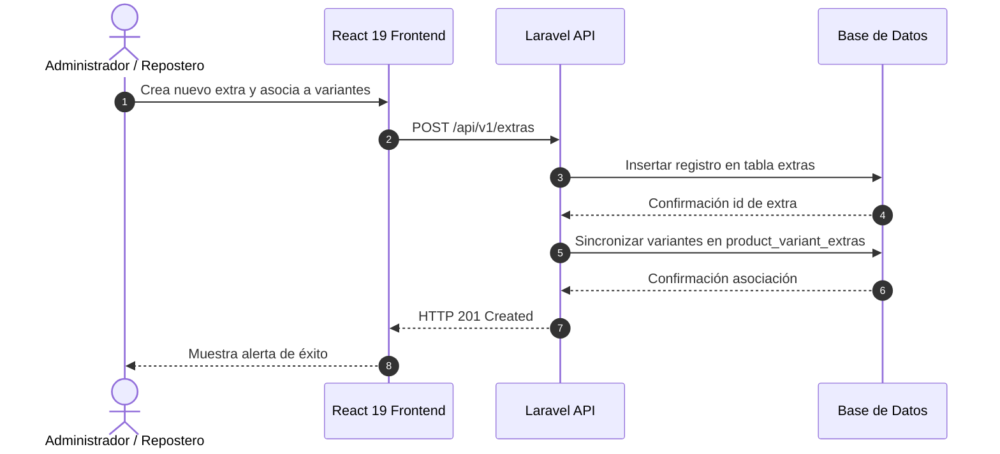
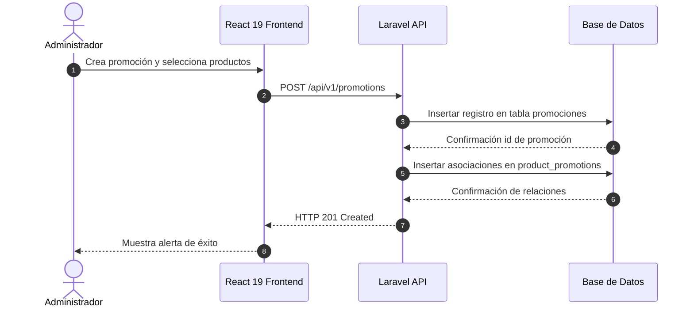
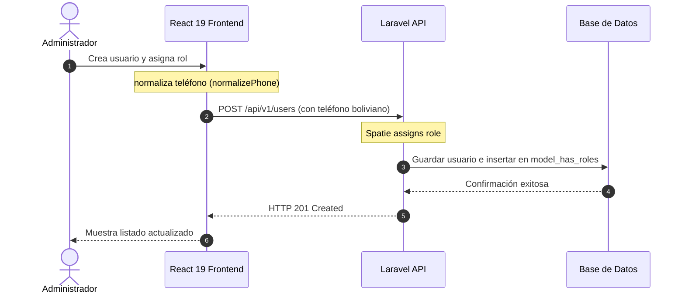
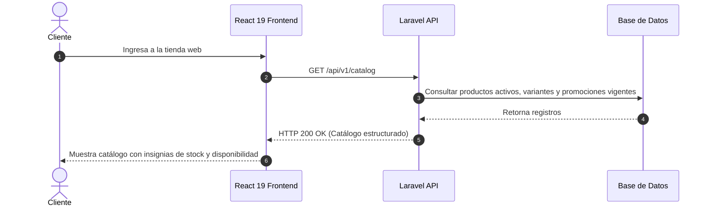

# Documentación Arquitectónica - Sprint 1

Este documento detalla el flujo de secuencia y la arquitectura de componentes de las Historias de Usuario de **Sprint 1** para el proyecto Dulce Encanto.

---

## HU-01 - Administrar categorías del catálogo

### Título
**Diagrama de secuencia HU-01 - Administrar Categorías**

### Actores
- **Administrador**

### Componentes
- **Administrador** (Actor)
- **React 19 Frontend (Módulo de Categorías)** (Capa de Presentación)
- **Laravel API** (Capa de Negocio)
- **MySQL / Supabase** (Capa de Datos)

### Flujo Principal (Crear / Editar / Eliminar / Consultar)
1. El **Administrador** ingresa a la sección de categorías en el panel.
2. **React 19 Frontend** solicita el listado de categorías a la **Laravel API**.
3. **Laravel API** consulta las categorías en la **Base de Datos**.
4. **Base de Datos** retorna el listado de categorías.
5. **React 19 Frontend** renderiza la tabla.
6. El **Administrador** interactúa para:
   - **Crear**: Rellena el formulario y presiona "Guardar".
   - **Editar**: Modifica un registro y presiona "Actualizar".
   - **Eliminar**: Presiona "Eliminar" en la fila y confirma la alerta.
7. **React 19 Frontend** envía la petición HTTP (POST/PUT/DELETE) a la **Laravel API**.
8. **Laravel API** procesa y realiza la operación en la **Base de Datos**.
9. **Base de Datos** confirma la operación.
10. **Laravel API** responde con código de éxito (`200 OK` o `201 Created`).
11. **React 19 Frontend** notifica al usuario e invalida la consulta de categorías para refrescar la lista.

### Flujos Alternativos
*   **Creación con nombre existente (Error de Validación):**
    *   `Laravel API` detecta que el nombre de la categoría ya está registrado.
    *   `Laravel API` retorna un código `422 Unprocessable Entity` con el detalle del error.
    *   `React 19 Frontend` lee el error y muestra una alerta visual al Administrador indicando que la categoría ya existe.

### Archivos Relacionados
*   **Frontend:**
    *   [`Categories.tsx`](file:///c:/Users/VICTUS/.gemini/antigravity-ide/scratch/dulce-encanto/frontend/src/modules/categories/pages/Categories.tsx) (UI & Form)
    *   [`categoriesService.ts`](file:///c:/Users/VICTUS/.gemini/antigravity-ide/scratch/dulce-encanto/frontend/src/shared/services/categoriesService.ts) (API Requests)
*   **Backend:**
    *   [`CategoryController.php`](file:///c:/Users/VICTUS/.gemini/antigravity-ide/scratch/dulce-encanto/backend/app/Http/Controllers/Api/V1/CategoryController.php)
    *   [`CategoryRequest.php`](file:///c:/Users/VICTUS/.gemini/antigravity-ide/scratch/dulce-encanto/backend/app/Http/Requests/CategoryRequest.php)
    *   [`Category.php`](file:///c:/Users/VICTUS/.gemini/antigravity-ide/scratch/dulce-encanto/backend/app/Models/Category.php)

### Diagrama UML Recomendado

---

## HU-02 - Administrar productos, variantes e imágenes

### Título
**Diagrama de secuencia HU-02 - Administrar Productos, Variantes e Imágenes**

### Actores
- **Administrador**
- **Repostero**

### Componentes
- **Administrador / Repostero** (Actor)
- **React 19 Frontend (Módulo de Productos)** (Capa de Presentación)
- **Laravel API** (Capa de Negocio)
- **MySQL / Supabase** (Capa de Datos)
- **Supabase Storage** (Servicio Externo)

### Flujo Principal
1. El **Administrador/Repostero** ingresa a la administración de productos.
2. **React 19 Frontend** solicita la lista de productos y variantes a la **Laravel API**.
3. **Laravel API** consulta en la **Base de Datos** y responde.
4. Para **crear producto con variante e imagen**:
   1. El usuario carga la imagen en el formulario.
   2. **React 19 Frontend** envía la imagen primero al backend.
   3. **Laravel API** sube el archivo a **Supabase Storage**.
   4. **Supabase Storage** devuelve la URL pública del archivo.
   5. **Laravel API** registra la URL de la imagen en la **Base de Datos**.
   6. El usuario configura variante (tamaño, precio, modalidad `READY_STOCK` o `MADE_TO_ORDER`).
   7. **React 19 Frontend** envía el formulario completo de producto y variante a la **Laravel API**.
   8. **Laravel API** inserta la información del producto, variante y relaciones en la **Base de Datos**.
   9. **Base de Datos** confirma.
   10. **Laravel API** responde con código `201 Created`.

### Flujos Alternativos
*   **Variante READY_STOCK sin stock inicial:**
    *   Si se define una presentación en modalidad `READY_STOCK`, se permite establecer el campo `stock`.
    *   Si no se ingresa stock o el valor es inválido, la validación del backend retorna `422`.
    *   El frontend visualiza el error requiriendo corregir el campo de stock.

### Archivos Relacionados
*   **Frontend:**
    *   [`Products.tsx`](file:///c:/Users/VICTUS/.gemini/antigravity-ide/scratch/dulce-encanto/frontend/src/modules/products/pages/Products.tsx) (UI & Form)
    *   [`productsService.ts`](file:///c:/Users/VICTUS/.gemini/antigravity-ide/scratch/dulce-encanto/frontend/src/shared/services/productsService.ts) (API)
*   **Backend:**
    *   [`ProductController.php`](file:///c:/Users/VICTUS/.gemini/antigravity-ide/scratch/dulce-encanto/backend/app/Http/Controllers/Api/V1/ProductController.php)
    *   [`ProductVariantController.php`](file:///c:/Users/VICTUS/.gemini/antigravity-ide/scratch/dulce-encanto/backend/app/Http/Controllers/Api/V1/ProductVariantController.php)
    *   [`ProductImageController.php`](file:///c:/Users/VICTUS/.gemini/antigravity-ide/scratch/dulce-encanto/backend/app/Http/Controllers/Api/V1/ProductImageController.php)
    *   [`Product.php`](file:///c:/Users/VICTUS/.gemini/antigravity-ide/scratch/dulce-encanto/backend/app/Models/Product.php)
    *   [`ProductVariant.php`](file:///c:/Users/VICTUS/.gemini/antigravity-ide/scratch/dulce-encanto/backend/app/Models/ProductVariant.php)

### Diagrama UML Recomendado

---

## HU-03 - Administrar extras asociados a variantes

### Título
**Diagrama de secuencia HU-03 - Administrar Adicionales (Extras)**

### Actores
- **Administrador**
- **Repostero**

### Componentes
- **Administrador / Repostero** (Actor)
- **React 19 Frontend (Módulo de Extras)** (Capa de Presentación)
- **Laravel API** (Capa de Negocio)
- **MySQL / Supabase** (Capa de Datos)

### Flujo Principal
1. El usuario entra a la pantalla de Extras en el Panel Administrativo.
2. **React 19 Frontend** carga los extras desde la **Laravel API**.
3. El usuario completa los datos del adicional (Nombre del extra, Precio adicional) y selecciona las variantes de productos asociadas.
4. **React 19 Frontend** envía la petición HTTP (POST/PUT/DELETE) a la **Laravel API**.
5. **Laravel API** persiste el extra en la tabla `extras` de la **Base de Datos** y actualiza la tabla intermedia `product_variant_extras`.
6. La **Base de Datos** guarda los registros y responde.
7. **Laravel API** responde HTTP `200 OK` / `201 Created`.
8. **React 19 Frontend** actualiza el listado.

### Archivos Relacionados
*   **Frontend:**
    *   [`Extras.tsx`](file:///c:/Users/VICTUS/.gemini/antigravity-ide/scratch/dulce-encanto/frontend/src/modules/extras/pages/Extras.tsx)
    *   [`extrasService.ts`](file:///c:/Users/VICTUS/.gemini/antigravity-ide/scratch/dulce-encanto/frontend/src/shared/services/extrasService.ts)
*   **Backend:**
    *   [`ExtraController.php`](file:///c:/Users/VICTUS/.gemini/antigravity-ide/scratch/dulce-encanto/backend/app/Http/Controllers/Api/V1/ExtraController.php)
    *   [`ExtraRequest.php`](file:///c:/Users/VICTUS/.gemini/antigravity-ide/scratch/dulce-encanto/backend/app/Http/Requests/ExtraRequest.php)
    *   [`Extra.php`](file:///c:/Users/VICTUS/.gemini/antigravity-ide/scratch/dulce-encanto/backend/app/Models/Extra.php)

### Diagrama UML Recomendado

---

## HU-04 - Administrar promociones

### Título
**Diagrama de secuencia HU-04 - Administrar Promociones**

### Actores
- **Administrador**

### Componentes
- **Administrador** (Actor)
- **React 19 Frontend (Módulo de Promociones)** (Capa de Presentación)
- **Laravel API** (Capa de Negocio)
- **MySQL / Supabase** (Capa de Datos)

### Flujo Principal
1. El **Administrador** entra a la pantalla de promociones.
2. El **Administrador** ingresa los datos (Nombre de promo, descripción, tipo de descuento, fechas de vigencia) y selecciona los productos que aplican.
3. **React 19 Frontend** envía la petición HTTP a la **Laravel API**.
4. **Laravel API** inserta la promoción y mapea las relaciones de productos asociados en `product_promotions`.
5. **Base de Datos** confirma y persiste los cambios.
6. **Laravel API** retorna `201 Created`.
7. **React 19 Frontend** refresca la interfaz.

### Archivos Relacionados
*   **Frontend:**
    *   [`Promotions.tsx`](file:///c:/Users/VICTUS/.gemini/antigravity-ide/scratch/dulce-encanto/frontend/src/modules/promotions/pages/Promotions.tsx)
    *   [`promotionsService.ts`](file:///c:/Users/VICTUS/.gemini/antigravity-ide/scratch/dulce-encanto/frontend/src/shared/services/promotionsService.ts)
*   **Backend:**
    *   [`PromotionController.php`](file:///c:/Users/VICTUS/.gemini/antigravity-ide/scratch/dulce-encanto/backend/app/Http/Controllers/Api/V1/PromotionController.php)
    *   [`PromotionRequest.php`](file:///c:/Users/VICTUS/.gemini/antigravity-ide/scratch/dulce-encanto/backend/app/Http/Requests/PromotionRequest.php)
    *   [`Promotion.php`](file:///c:/Users/VICTUS/.gemini/antigravity-ide/scratch/dulce-encanto/backend/app/Models/Promotion.php)

### Diagrama UML Recomendado

---

## HU-05 - Administrar usuarios y roles

### Título
**Diagrama de secuencia HU-05 - Administrar Usuarios y Roles**

### Actores
- **Administrador**

### Componentes
- **Administrador** (Actor)
- **React 19 Frontend (Módulo de Usuarios)** (Capa de Presentación)
- **Laravel API** (Capa de Negocio con Spatie Permission)
- **MySQL / Supabase** (Capa de Datos)

### Flujo Principal
1. El **Administrador** ingresa a la gestión de usuarios.
2. **React 19 Frontend** solicita el listado a la **Laravel API**.
3. **Laravel API** consulta los usuarios, roles y permisos en la **Base de Datos**.
4. **Base de Datos** devuelve la información.
5. El **Administrador** ingresa o edita un usuario, asocia su número telefónico normalizado y selecciona un Rol (ej: Repostero, Encargado Comercial).
6. **React 19 Frontend** limpia y normaliza el número de teléfono con `normalizePhone()`.
7. **React 19 Frontend** envía la petición con el payload normalizado a la **Laravel API**.
8. **Laravel API** valida y persiste al usuario (el mutador en `User.php` normaliza el número final en backend).
9. **Laravel API** asocia el rol mediante Spatie `assignRole()`.
10. **Base de Datos** persiste la relación.
11. **Laravel API** retorna un HTTP `200/201`.
12. **React 19 Frontend** actualiza la UI.

### Archivos Relacionados
*   **Frontend:**
    *   [`Users.tsx`](file:///c:/Users/VICTUS/.gemini/antigravity-ide/scratch/dulce-encanto/frontend/src/modules/users/pages/Users.tsx)
    *   [`usersService.ts`](file:///c:/Users/VICTUS/.gemini/antigravity-ide/scratch/dulce-encanto/frontend/src/shared/services/usersService.ts)
    *   [`phone.ts`](file:///c:/Users/VICTUS/.gemini/antigravity-ide/scratch/dulce-encanto/frontend/src/shared/utils/phone.ts) (Normalizador)
*   **Backend:**
    *   [`UserController.php`](file:///c:/Users/VICTUS/.gemini/antigravity-ide/scratch/dulce-encanto/backend/app/Http/Controllers/Api/V1/UserController.php)
    *   [`UserRequest.php`](file:///c:/Users/VICTUS/.gemini/antigravity-ide/scratch/dulce-encanto/backend/app/Http/Requests/UserRequest.php)
    *   [`User.php`](file:///c:/Users/VICTUS/.gemini/antigravity-ide/scratch/dulce-encanto/backend/app/Models/User.php)

### Diagrama UML Recomendado

---

## HU-07 - Visualizar catálogo público

### Título
**Diagrama de secuencia HU-07 - Explorar Catálogo Público**

### Actores
- **Cliente**

### Componentes
- **Cliente** (Actor)
- **React 19 Frontend (Módulo de Catálogo Público)** (Capa de Presentación)
- **Laravel API** (Capa de Negocio)
- **MySQL / Supabase** (Capa de Datos)

### Flujo Principal
1. El **Cliente** ingresa al Catálogo de Dulce Encanto (Vista Pública).
2. **React 19 Frontend** solicita las categorías, productos, variantes y promociones vigentes de forma asíncrona a la **Laravel API**.
3. **Laravel API** consulta las tablas correspondientes aplicando filtros de elementos activos y promociones en rango de fecha vigente.
4. **Base de Datos** retorna la información.
5. **Laravel API** mapea y retorna las variantes con su respectivo tipo de venta (`READY_STOCK` / `MADE_TO_ORDER`), stock disponible y descuento.
6. **React 19 Frontend** muestra el listado de productos, filtros y promociones vigentes al **Cliente**.
7. El **Cliente** filtra por categoría o busca un producto por nombre.
8. **React 19 Frontend** procesa localmente o vuelve a consultar al backend con el query del filtro.
9. El catálogo refleja en tiempo real la información consultada.

### Archivos Relacionados
*   **Frontend:**
    *   [`Catalog.tsx`](file:///c:/Users/VICTUS/.gemini/antigravity-ide/scratch/dulce-encanto/frontend/src/modules/catalog/pages/Catalog.tsx)
    *   [`catalogService.ts`](file:///c:/Users/VICTUS/.gemini/antigravity-ide/scratch/dulce-encanto/frontend/src/shared/services/catalogService.ts)
*   **Backend:**
    *   [`CatalogController.php`](file:///c:/Users/VICTUS/.gemini/antigravity-ide/scratch/dulce-encanto/backend/app/Http/Controllers/Api/V1/CatalogController.php)

### Diagrama UML Recomendado

