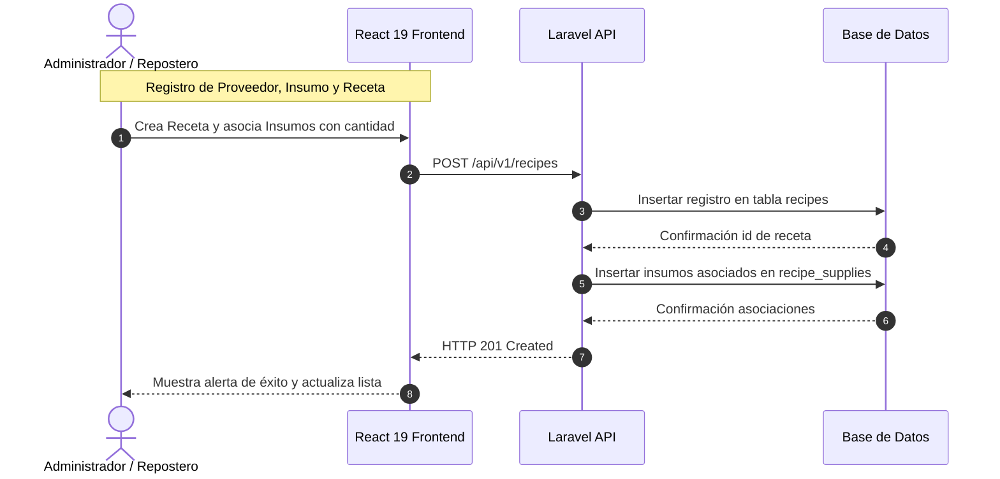
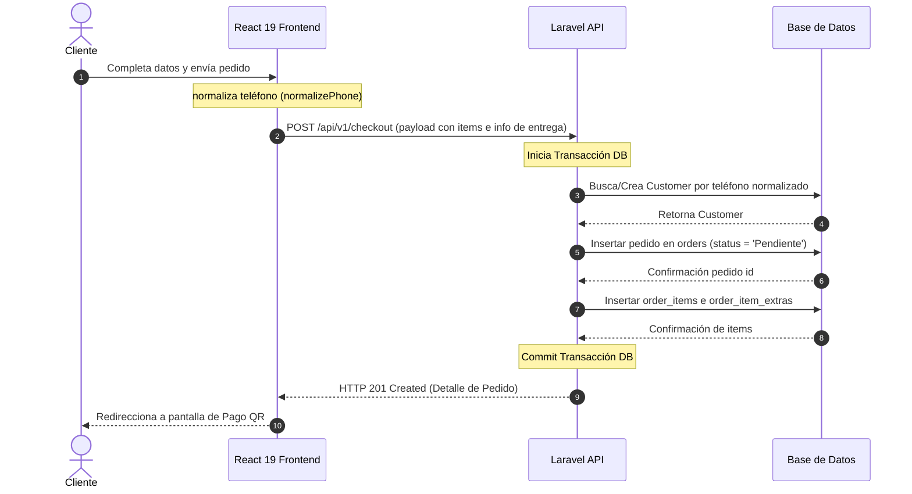
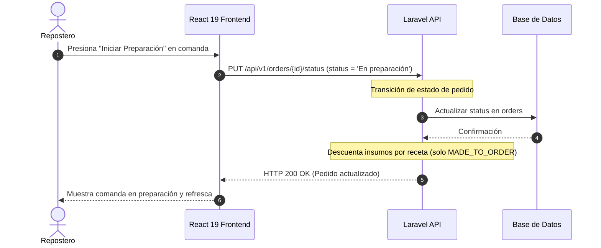
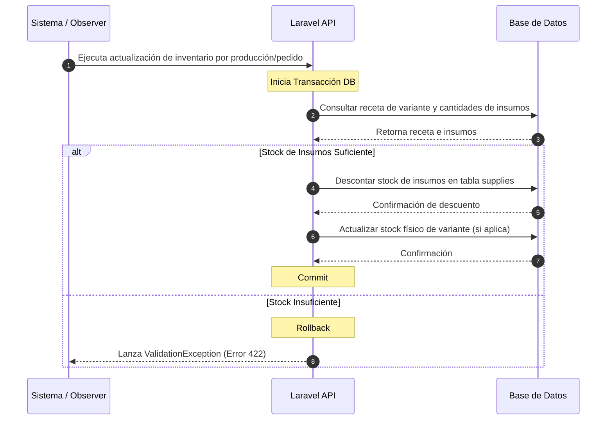

# Documentación Arquitectónica - Sprint 2

Este documento detalla el flujo de secuencia y la arquitectura de componentes de las Historias de Usuario de **Sprint 2** para el proyecto Dulce Encanto.

---

## HU-06 - Gestionar insumos, proveedores y recetas

### Título
**Diagrama de secuencia HU-06 - Gestionar Inventario (Insumos, Proveedores y Recetas)**

### Actores
- **Administrador**
- **Repostero**

### Componentes
- **Administrador / Repostero** (Actor)
- **React 19 Frontend (Módulo de Producción/Inventario)** (Capa de Presentación)
- **Laravel API** (Capa de Negocio)
- **MySQL / Supabase** (Capa de Datos)

### Flujo Principal
1. El usuario accede al panel de inventario y registra un **Proveedor** indicando su teléfono boliviano.
   - **React 19 Frontend** aplica `normalizePhone()` al teléfono antes de enviarlo.
2. El usuario registra un **Insumo** (ej. Harina, Azúcar) definiendo unidad (kg, unidad), stock inicial y costo.
3. El usuario crea una **Receta** para una variante de producto específica:
   - Ingresa nombre, porciones y asocia insumos indicando la cantidad consumida.
4. **React 19 Frontend** envía la petición HTTP a la **Laravel API**.
5. **Laravel API** valida los datos e inserta los registros en la **Base de Datos** (tablas `suppliers`, `supplies`, `recipes` y tabla pivot `recipe_supplies`).
6. **Base de Datos** confirma.
7. **Laravel API** responde con código `201 Created`.
8. **React 19 Frontend** actualiza el listado.

### Archivos Relacionados
*   **Frontend:**
    *   [`Suppliers.tsx`](file:///c:/Users/VICTUS/.gemini/antigravity-ide/scratch/dulce-encanto/frontend/src/modules/suppliers/pages/Suppliers.tsx) (CRUD Proveedores)
    *   [`Supplies.tsx`](file:///c:/Users/VICTUS/.gemini/antigravity-ide/scratch/dulce-encanto/frontend/src/modules/supplies/pages/Supplies.tsx) (CRUD Insumos)
    *   [`Recipes.tsx`](file:///c:/Users/VICTUS/.gemini/antigravity-ide/scratch/dulce-encanto/frontend/src/modules/recipes/pages/Recipes.tsx) (CRUD Recetas)
*   **Backend:**
    *   [`SupplierController.php`](file:///c:/Users/VICTUS/.gemini/antigravity-ide/scratch/dulce-encanto/backend/app/Http/Controllers/Api/V1/SupplierController.php)
    *   [`SupplyController.php`](file:///c:/Users/VICTUS/.gemini/antigravity-ide/scratch/dulce-encanto/backend/app/Http/Controllers/Api/V1/SupplyController.php)
    *   [`RecipeController.php`](file:///c:/Users/VICTUS/.gemini/antigravity-ide/scratch/dulce-encanto/backend/app/Http/Controllers/Api/V1/RecipeController.php)

### Diagrama UML Recomendado

---

## HU-08 - Gestionar pedidos desde catálogo web

### Título
**Diagrama de secuencia HU-08 - Crear Pedido Web (Checkout)**

### Actores
- **Cliente**

### Componentes
- **Cliente** (Actor)
- **React 19 Frontend (Módulo de Catálogo - Checkout)** (Capa de Presentación)
- **Laravel API** (Capa de Negocio)
- **MySQL / Supabase** (Capa de Datos)

### Flujo Principal
1. El **Cliente** selecciona variantes en el catálogo, agrega adicionales (extras) y hace clic en "Finalizar Compra".
2. **React 19 Frontend** abre el modal de Checkout, donde se ingresan: Nombre, Teléfono boliviano, tipo de entrega (Delivery/Retiro), dirección, observaciones, fecha y hora de entrega.
3. El **Cliente** envía el pedido.
4. **React 19 Frontend** normaliza el teléfono del cliente usando `normalizePhone()`.
5. **React 19 Frontend** envía el payload estructurado con los ítems (variantes, cantidades y extras) mediante un `POST /api/v1/checkout` a la **Laravel API**.
6. **Laravel API**:
   - Inicia una transacción de base de datos.
   - Normaliza y busca/crea al `Customer` en base a su teléfono boliviano.
   - Registra el pedido en la tabla `orders` con estado inicial `'Pendiente'`.
   - Mapea y guarda los ítems en `order_items` y adicionales en `order_item_extras`.
   - Calcula el total sumando precios de variantes y extras, restando promociones vigentes.
7. **Base de Datos** confirma todos los registros.
8. **Laravel API** responde con código `201 Created` y el objeto del pedido creado.
9. **React 19 Frontend** limpia el carrito y redirecciona al cliente a la página de pago.

### Flujos Alternativos
*   **Pedido con fecha de entrega inválida para Tortas Bajo Pedido (Error de Validación):**
    *   Si el pedido contiene alguna torta (`Torta`) en modalidad `MADE_TO_ORDER` y la fecha/hora de entrega seleccionada es menor a 24 horas a partir del momento actual:
    *   `React 19 Frontend` bloquea el envío y muestra un mensaje de alerta solicitando una anticipación mínima de 24 horas.
*   **Tortas de Disponibilidad Inmediata (READY_STOCK):**
    *   Si la torta es modalidad `READY_STOCK`, se permite programar la entrega de forma inmediata sin la restricción de las 24 horas. El sistema valida y limita la cantidad máxima que se puede agregar al pedido al stock físico disponible.

### Dependencias
- Requiere de **HU-02** (Productos y variantes) y **HU-03** (Extras).

### Archivos Relacionados
*   **Frontend:**
    *   [`CheckoutModal.tsx`](file:///c:/Users/VICTUS/.gemini/antigravity-ide/scratch/dulce-encanto/frontend/src/modules/catalog/components/CheckoutModal.tsx)
    *   [`ordersService.ts`](file:///c:/Users/VICTUS/.gemini/antigravity-ide/scratch/dulce-encanto/frontend/src/shared/services/ordersService.ts)
*   **Backend:**
    *   [`OrderController.php`](file:///c:/Users/VICTUS/.gemini/antigravity-ide/scratch/dulce-encanto/backend/app/Http/Controllers/Api/V1/OrderController.php)
    *   [`OrderService.php`](file:///c:/Users/VICTUS/.gemini/antigravity-ide/scratch/dulce-encanto/backend/app/Services/OrderService.php)
    *   [`StoreOrderRequest.php`](file:///c:/Users/VICTUS/.gemini/antigravity-ide/scratch/dulce-encanto/backend/app/Http/Requests/StoreOrderRequest.php)

### Diagrama UML Recomendado

---

## HU-11 - Gestionar producción y seguimiento de pedidos

### Título
**Diagrama de secuencia HU-11 - Gestión de Producción y Estados de Pedido**

### Actores
- **Repostero**

### Componentes
- **Repostero** (Actor)
- **React 19 Frontend (Módulo de Producción)** (Capa de Presentación)
- **Laravel API** (Capa de Negocio)
- **MySQL / Supabase** (Capa de Datos)

### Flujo Principal
1. El **Repostero** ingresa a la sección de Producción en el panel administrativo.
2. **React 19 Frontend** solicita el listado de pedidos en cocina a la **Laravel API**.
3. **Laravel API** consulta las órdenes activas en la **Base de Datos** y las retorna.
4. El **Repostero** visualiza la comanda e inicia el trabajo en un pedido presionando "Iniciar Preparación":
   - **React 19 Frontend** envía un `PUT /api/v1/orders/{id}/status` con valor `'En preparación'` a la **Laravel API**.
   - **Laravel API** cambia el estado de la orden y ejecuta el flujo diferencial de inventario (ver **HU-12**).
   - **Base de Datos** actualiza la orden.
5. El **Repostero** termina la cocción del pedido y presiona "Listo":
   - Se envía la actualización a `'Listo'`.
   - Se dispara la alerta de notificación de pedido listo (ver **HU-13**).
6. Para variantes con modalidad `READY_STOCK`, el Repostero también puede registrar producción de lotes manuales desde la pestaña de Lotes de Producción:
   - Completa el modal especificando la variante `READY_STOCK` y cantidad.
   - **React 19 Frontend** envía la petición HTTP a `POST /api/v1/production`.
   - **Laravel API** consume los insumos de la receta de forma directa e incrementa el stock físico de la variante en la **Base de Datos**.

### Archivos Relacionados
*   **Frontend:**
    *   [`Production.tsx`](file:///c:/Users/VICTUS/.gemini/antigravity-ide/scratch/dulce-encanto/frontend/src/modules/production/pages/Production.tsx) (Vista de cocina y lotes)
    *   [`productionService.ts`](file:///c:/Users/VICTUS/.gemini/antigravity-ide/scratch/dulce-encanto/frontend/src/shared/services/productionService.ts) (API)
*   **Backend:**
    *   [`ProductionController.php`](file:///c:/Users/VICTUS/.gemini/antigravity-ide/scratch/dulce-encanto/backend/app/Http/Controllers/Api/V1/ProductionController.php)
    *   [`ProductionService.php`](file:///c:/Users/VICTUS/.gemini/antigravity-ide/scratch/dulce-encanto/backend/app/Services/ProductionService.php)
    *   [`OrderObserver.php`](file:///c:/Users/VICTUS/.gemini/antigravity-ide/scratch/dulce-encanto/backend/app/Observers/OrderObserver.php)

### Diagrama UML Recomendado

---

## HU-12 - Control automático de consumo de insumos

### Título
**Diagrama de secuencia HU-12 - Consumo de Insumos Automático**

### Actores
- **Sistema** (Capa interna)

### Componentes
- **Sistema (Laravel Event / Observer)** (Actor interno)
- **Laravel API (OrderService / ProductionService)** (Capa de Negocio)
- **MySQL / Supabase** (Capa de Datos)

### Flujo Principal
1. Se detecta un cambio de estado en un pedido o el registro manual de un lote de producción:
   - **Caso A:** Un pedido cambia a `'En preparación'`. El **Sistema** recupera sus ítems.
     - Si el ítem es modalidad `MADE_TO_ORDER`: el sistema busca la receta de la variante, calcula las porciones requeridas de cada insumo multiplicando la cantidad de la orden por el peso unitario y los descuenta de la tabla `supplies`.
     - Si el ítem es modalidad `READY_STOCK`: el sistema reduce directamente el stock físico de la variante en `product_variants` (ya que los insumos fueron descontados previamente al fabricarse el lote).
   - **Caso B:** Se registra un lote manual de producción para una variante `READY_STOCK`.
     - El **Sistema** busca la receta, calcula los insumos en base a la cantidad ingresada, los reduce del inventario e incrementa el stock de la variante física.
2. **Laravel API** ejecuta las reducciones en una transacción de la **Base de Datos**.
3. Si el stock de algún insumo queda por debajo del mínimo, el sistema dispara un evento para enviar una notificación de advertencia de stock bajo.
4. Se hace Commit de la transacción.

### Flujos Alternativos
*   **Insumos Insuficientes (Error de Inventario):**
    *   Si los kg/unidades disponibles de algún insumo en el inventario son inferiores a la cantidad calculada por receta:
    *   La **Laravel API** revierte la transacción (`Rollback`) y lanza una `ValidationException` (código `422`).
    *   El cambio de estado o registro del lote se cancela e informa el insumo faltante.

### Archivos Relacionados
*   **Backend:**
    *   [`OrderService.php`](file:///c:/Users/VICTUS/.gemini/antigravity-ide/scratch/dulce-encanto/backend/app/Services/OrderService.php)
    *   [`ProductionService.php`](file:///c:/Users/VICTUS/.gemini/antigravity-ide/scratch/dulce-encanto/backend/app/Services/ProductionService.php)
    *   [`OrderObserver.php`](file:///c:/Users/VICTUS/.gemini/antigravity-ide/scratch/dulce-encanto/backend/app/Observers/OrderObserver.php)

### Diagrama UML Recomendado

---

## HU-14 - Generar reportes administrativos

### Título
**Diagrama de secuencia HU-14 - Generar Reportes Administrativos**

### Actores
- **Administrador**

### Componentes
- **Administrador** (Actor)
- **React 19 Frontend (Módulo de Reportes)** (Capa de Presentación)
- **Laravel API** (Capa de Negocio)
- **MySQL / Supabase** (Capa de Datos)

### Flujo Principal
1. El **Administrador** ingresa al panel de Reportes e Indicadores.
2. **React 19 Frontend** solicita las métricas de negocio a la **Laravel API**.
3. **Laravel API** realiza consultas agregadas (ventas totales, pedidos listos vs entregados, stock de insumos críticos) en la **Base de Datos** (utilizando las vistas SQL optimizadas del sistema).
4. **Base de Datos** procesa y retorna las sumatorias y conteos.
5. **Laravel API** formatea los datos y responde HTTP `200 OK`.
6. **React 19 Frontend** genera gráficos y tablas interactivas de ventas e inventario.

### Archivos Relacionados
*   **Frontend:**
    *   [`Reports.tsx`](file:///c:/Users/VICTUS/.gemini/antigravity-ide/scratch/dulce-encanto/frontend/src/modules/reports/pages/Reports.tsx)
*   **Backend:**
    *   [`ReportController.php`](file:///c:/Users/VICTUS/.gemini/antigravity-ide/scratch/dulce-encanto/backend/app/Http/Controllers/Api/V1/ReportController.php)
    *   [`ReportRepository.php`](file:///c:/Users/VICTUS/.gemini/antigravity-ide/scratch/dulce-encanto/backend/app/Repositories/ReportRepository.php)
