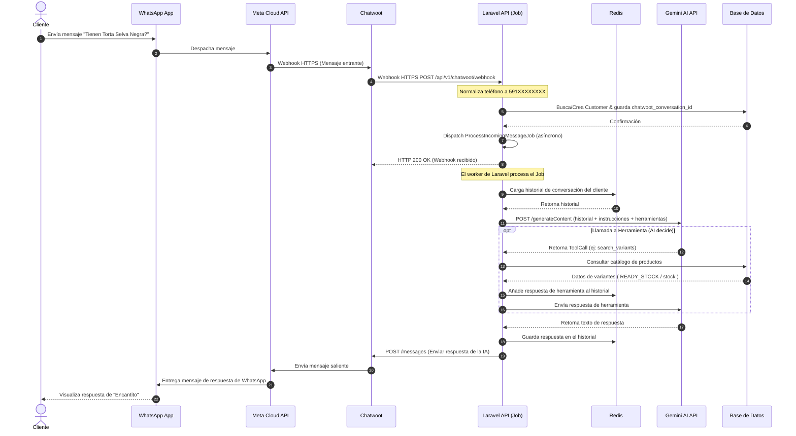
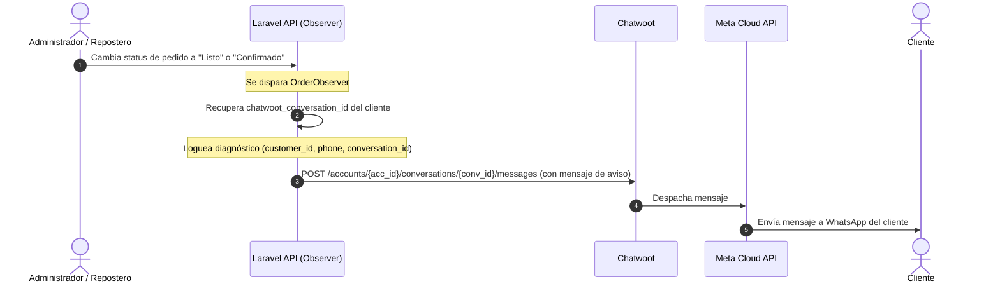

# Documentación Arquitectónica - Sprint 3

Este documento detalla el flujo de secuencia y la arquitectura de componentes de las Historias de Usuario de **Sprint 3** para el proyecto Dulce Encanto.

---

## HU-09 - Automatizar atención mediante WhatsApp (Chatbot IA)

### Título
**Diagrama de secuencia HU-09 - Chatbot IA Conversacional por WhatsApp**

### Actores
- **Cliente**

### Componentes
- **Cliente** (Actor)
- **WhatsApp Mobile App** (Capa de Mensajería del Cliente)
- **Meta WhatsApp Cloud API** (Capa de Comunicaciones)
- **Chatwoot** (Capa de Inbox y Canales)
- **Laravel Backend (Webhook / Jobs)** (Capa de Negocio)
- **Redis (Contexto de Conversación)** (Capa de Memoria Temporal)
- **Groq / Gemini AI API** (Servicio LLM de Inteligencia Artificial)
- **Base de Datos** (Capa de Persistencia)

### Flujo Principal
1. El **Cliente** envía un mensaje por chat (ej. *"¿Tienen torta selva negra?"*).
2. **Meta WhatsApp Cloud API** recibe el mensaje y lo despacha de forma segura a **Chatwoot** mediante un webhook HTTPS.
3. **Chatwoot** añade el mensaje al hilo de conversación del cliente y despacha una notificación Webhook HTTPS a la **Laravel API**.
4. **Laravel API** (`ChatwootWebhookService`):
   - Valida la autenticidad e idempotencia del mensaje.
   - Extrae el número telefónico y lo normaliza en formato canónico de Bolivia `591XXXXXXXX` usando `PhoneHelper::normalize()`.
   - Busca o crea un registro `Customer` con el teléfono normalizado y actualiza su `chatwoot_conversation_id`.
   - Despacha de forma asíncrona un Job a la cola de trabajo: `ProcessIncomingMessageJob`.
5. El worker de colas ejecuta `ProcessIncomingMessageJob` que invoca al `ConversationOrchestrator`:
   - Carga la sesión y el historial de conversación del cliente desde **Redis** (usando `RedisConversationMemory`).
   - Envía el historial acumulado, herramientas disponibles (catálogo, borrador, etc.) y pautas de comportamiento a la **Gemini AI API**.
6. **Gemini AI API** interpreta el lenguaje natural del cliente:
   - **Caso A (Llamada a Herramientas):** Decide ejecutar una herramienta (ej. `search_variants`).
     - El orquestador ejecuta la herramienta localmente en el backend, consulta la **Base de Datos** y añade la respuesta a la memoria de **Redis**.
     - Envía la respuesta de la herramienta a la **Gemini AI API** para que redacte el mensaje final.
   - **Caso B (Respuesta Textual):** Genera la respuesta definitiva en texto en base a la información del catálogo o borrador de compra.
7. El orquestador guarda el mensaje generado en **Redis** y llama a la API de **Chatwoot** (`ChatwootService->sendMessage()`).
8. **Chatwoot** guarda el mensaje saliente y lo despacha a la **Meta WhatsApp Cloud API**.
9. **Meta** entrega el mensaje de respuesta de WhatsApp al **Cliente** (ej. *"¡Hola! Sí, tenemos Torta Selva Negra en tamaño mediano por Bs. 25..."*).

### Flujos Alternativos
*   **Gemini API Fails / Timeout:**
    *   Si la llamada a la IA o base de datos falla durante la ejecución del job:
    *   El worker atrapa la excepción y registra el error de diagnóstico en los logs de Laravel.
    *   El hilo se recupera de manera segura sin colapsar el hilo principal del Webhook HTTP de Chatwoot.

### Archivos Relacionados
*   **Backend:**
    *   [`ChatwootWebhookService.php`](file:///c:/Users/VICTUS/.gemini/antigravity-ide/scratch/dulce-encanto/backend/app/Services/ChatwootWebhookService.php)
    *   [`ProcessIncomingMessageJob.php`](file:///c:/Users/VICTUS/.gemini/antigravity-ide/scratch/dulce-encanto/backend/app/Jobs/ProcessIncomingMessageJob.php)
    *   [`ConversationOrchestrator.php`](file:///c:/Users/VICTUS/.gemini/antigravity-ide/scratch/dulce-encanto/backend/app/AI/Orchestrators/ConversationOrchestrator.php)
    *   [`RedisConversationMemory.php`](file:///c:/Users/VICTUS/.gemini/antigravity-ide/scratch/dulce-encanto/backend/app/AI/Memory/RedisConversationMemory.php)
    *   [`GeminiProvider.php`](file:///c:/Users/VICTUS/.gemini/antigravity-ide/scratch/dulce-encanto/backend/app/AI/Providers/GeminiProvider.php)
    *   [`PhoneHelper.php`](file:///c:/Users/VICTUS/.gemini/antigravity-ide/scratch/dulce-encanto/backend/app/Support/PhoneHelper.php)

### Diagrama UML Recomendado

---

## HU-13 - Notificar pedido listo

### Título
**Diagrama de secuencia HU-13 - Notificación de Pedido Listo**

### Actores
- **Cliente**
- **Sistema** (Capa de Negocio)

### Componentes
- **Sistema (Laravel Observer)** (Actor interno)
- **Laravel API (OrderNotificationService)** (Capa de Negocio)
- **Chatwoot** (Inbox / WhatsApp API)
- **Meta WhatsApp Cloud API** (Capa de Comunicaciones)
- **Cliente** (Actor)

### Flujo Principal
1. Se transiciona el estado de un pedido a `'Listo'` o `'Confirmado'` en el panel de administración.
2. El **Sistema** (`OrderObserver`) captura el evento `updated` de la orden.
3. Si el estado cambia a:
   - **`Listo`**: El observador llama a `notifyStatusReady($order)`.
   - **`Confirmado`**: El observador llama a `notifyClientOrderConfirmed($order)`.
4. El servicio `OrderNotificationService` recupera el `$order->customer` y extrae su número y `chatwoot_conversation_id`.
5. Si el cliente cuenta con una conversación activa de Chatwoot:
   - Se genera el texto personalizado (ej. *"Tu pedido #X ha sido confirmado..."* o *"Tu pedido #X ya está listo..."*).
   - Se registra el log de diagnóstico indicando `customer_id`, `phone` y `conversation_id`.
   - **Laravel API** llama a `ChatwootService->sendMessage()` para enviar el mensaje.
6. **Chatwoot** despacha el mensaje mediante la **Meta WhatsApp Cloud API**.
7. La API entrega la notificación al dispositivo de WhatsApp del **Cliente**.

### Archivos Relacionados
*   **Backend:**
    *   [`OrderObserver.php`](file:///c:/Users/VICTUS/.gemini/antigravity-ide/scratch/dulce-encanto/backend/app/Observers/OrderObserver.php)
    *   [`OrderNotificationService.php`](file:///c:/Users/VICTUS/.gemini/antigravity-ide/scratch/dulce-encanto/backend/app/Services/OrderNotificationService.php)
    *   [`ChatwootService.php`](file:///c:/Users/VICTUS/.gemini/antigravity-ide/scratch/dulce-encanto/backend/app/Services/ChatwootService.php)

### Diagrama UML Recomendado

