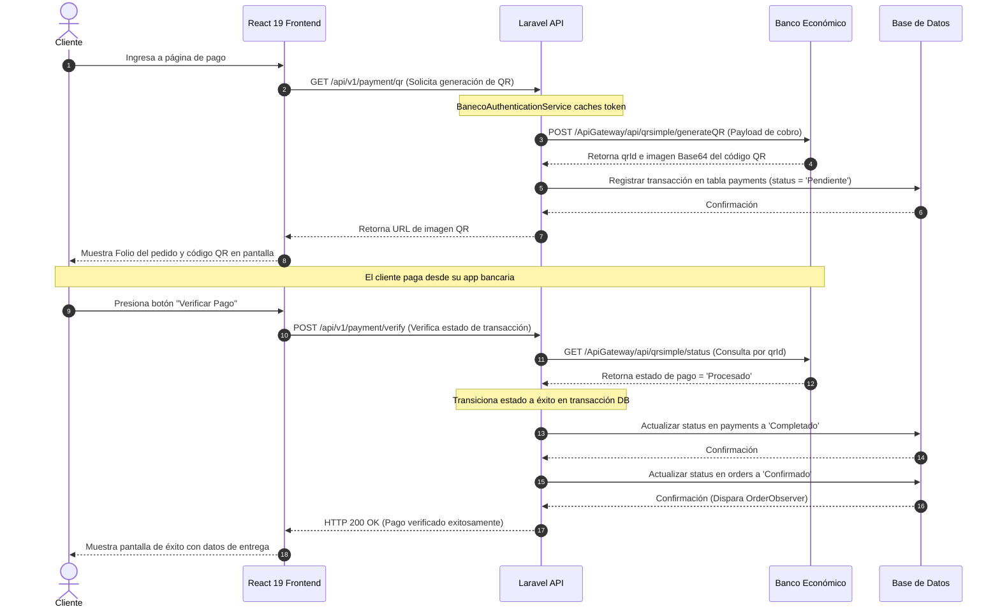

# Documentación Arquitectónica - Sprint 4

Este documento detalla el flujo de secuencia y la arquitectura de componentes de las Historias de Usuario de **Sprint 4** para el proyecto Dulce Encanto.

---

## HU-10 - Gestionar pago mediante código QR

### Título
**Diagrama de secuencia HU-10 - Pago de Pedido Mediante Código QR (Banco Económico)**

### Actores
- **Cliente**

### Componentes
- **Cliente** (Actor)
- **React 19 Frontend (Módulo de Pagos)** (Capa de Presentación)
- **Laravel API** (Capa de Negocio)
- **Banco Económico API Market** (Servicio Financiero Externo)
- **MySQL / Supabase** (Capa de Datos)

### Flujo Principal
1. El **Cliente** realiza la orden y es redirigido a la página de Pago.
2. **React 19 Frontend** solicita los detalles del pago a la **Laravel API**.
3. **Laravel API**:
   - Genera una solicitud de código QR.
   - Envía los datos (ID de transacción, total de la orden en Bs., currency `BOB`, vigencia de expiración) a la API del **Banco Económico API Market**.
4. **Banco Económico API Market** procesa la solicitud, genera la transacción de cobro y devuelve la imagen del código QR (en formato Base64) y el ID del QR (`qrId`).
5. **Laravel API** persiste el `qrId` y estado del pago como `'Pendiente'` en la tabla `payments` de la **Base de Datos**.
6. **Laravel API** retorna la imagen del código QR a **React 19 Frontend**.
7. **React 19 Frontend** despliega la imagen del código QR en pantalla y solicita al cliente que realice el pago mediante su aplicación bancaria móvil.
8. El **Cliente** escanea y paga.
9. **Banco Económico API Market** procesa la transferencia de forma externa.
10. El cliente o la pasarela solicita la verificación de la transacción:
    - **React 19 Frontend** envía una petición de verificación `POST /api/v1/payment/verify` a la **Laravel API**.
    - **Laravel API** consulta el estado de la transacción directamente al **Banco Económico API Market**.
11. **Banco Económico API Market** responde indicando que la transacción fue procesada exitosamente.
12. **Laravel API**:
    - Cambia el estado del pago a `'Completado'` en la **Base de Datos**.
    - Cambia el estado del pedido a `'Confirmado'` en la **Base de Datos** (lo que dispara la alerta para reposteros y el aviso por WhatsApp al cliente).
13. **Laravel API** retorna la confirmación de pago exitoso a **React 19 Frontend**.
14. **React 19 Frontend** despliega la pantalla de éxito.

### Flujos Alternativos
*   **Token de Banco Económico Expirado / Regeneración de Token:**
    *   Si al comunicarse con el `Banco Económico API Market` se obtiene un error `401 Unauthorized`:
    *   La `Laravel API` invalida el token de acceso local cacheado.
    *   Llama al servicio de autenticación de Banco Económico para generar y cachear un nuevo token portador.
    *   Vuelve a intentar realizar la petición de generación de QR de manera transparente para el cliente.

### Dependencias
- Depende de **HU-08** (Creación de pedidos).

### Archivos Relacionados
*   **Frontend:**
    *   [`PublicPayment.tsx`](file:///c:/Users/VICTUS/.gemini/antigravity-ide/scratch/dulce-encanto/frontend/src/modules/catalog/pages/PublicPayment.tsx)
*   **Backend:**
    *   [`PublicPaymentController.php`](file:///c:/Users/VICTUS/.gemini/antigravity-ide/scratch/dulce-encanto/backend/app/Http/Controllers/Api/V1/PublicPaymentController.php)
    *   [`PaymentService.php`](file:///c:/Users/VICTUS/.gemini/antigravity-ide/scratch/dulce-encanto/backend/app/Services/PaymentService.php)
    *   [`GenerateQRJob.php`](file:///c:/Users/VICTUS/.gemini/antigravity-ide/scratch/dulce-encanto/backend/app/Jobs/GenerateQRJob.php)
    *   [`BanecoAuthenticationService.php`](file:///c:/Users/VICTUS/.gemini/antigravity-ide/scratch/dulce-encanto/backend/app/Services/BanecoAuthenticationService.php)

### Diagrama UML Recomendado

